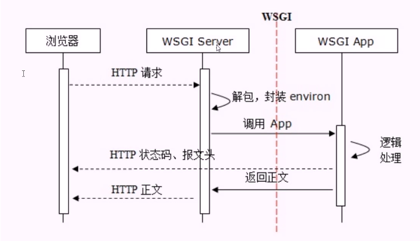
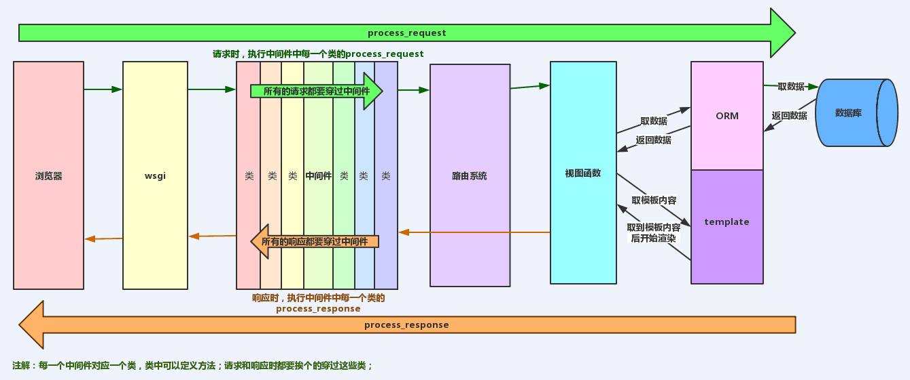

# **Web编程** WSGI,Django,Flask and Tornado
1. **C/S** and **B/S**
   - CS：客户端、服务器之间需要使用Socket,约定协议,版本（往往是用TCP或UDP）,指定地址和端口。数据可以有一定格式,双方约定好
   - BS: Browser浏览器,特殊的客户端,支持http(s)协议,通过URL向服务器发起请求,等待服务器返回HTML
        - HTTP协议基于TCP协议
2. HTTP协议
    1. 无状态：同一客户端的两次请求之间没有任何关系,从服务器端角度来看,他不知道这两次请求来自同一客户端。
       - 解决无状态：Cookie and Session
    2. 80端口,HTTPS 443端口
    
    常见传递信息方式：
    1. GET使用Query String
        通过查询字符串在URL中传递参数
    2. POST提交数据
        使用表单提交数据
       
    - 无状态：服务器无法知道2次请求之间的联系,通过cookie和session来判断
    - 有连接：基于TCP协议,面向连接的,需要3次握手、4次断开
    - 短链接：Http1.1之前是一个请求一个连接,Tcp创建销毁成本高;Http1.1之后支持keep-alive,默认开启,一个连接打开后,会保持一段时间(可设置),减轻服务器压力

3. Cookie
    - 解决HTTP无状态问题 
    - 保存登陆信息,明文保存,明文传输。浏览器支持压缩传输,但是可以解压缩。
    1. 键值对信息
    2. 浏览器发起每一次请求,都会把cookie信息发给服务器端
    3. 是一种客户端、服务器端传递数据的技术
    4. 服务器可以通过判断这些信息,来确定这次请求是否和之前的有关联
    5. 由服务器产生发给客户端
    6. 客户端可以自己配置Cookie信息
4. URL
    - 统一资源定位符
    - schema://host[:port#]/path/.../[;url-params][?query-string][#anchor]
        1. schema 模式、协议:
           http, ftp, https, mailto等 mysql等
        2. `host:port`: 域名会使用DNS解析,域名会解析成IP 
5. HTTP消息： 
    消息分为Request, Response
    - Request: 浏览器向服务器发起的请求
    - Response: 服务器对客户端发起的请求
    
    请求和响应都由`请求行`,`Header消息报头`,`Body消息正文`组成
   
    1. 请求
    - 请求消息行：请求方法Method 请求路径 协议版本CRLF
    
6. **wsgi**: 指定了web服务器和Python web应用或web框架之间的标准接口,以提高web应用在一系列web服务器间的移植性
    - Web程序必须有一个可调用对象,且该可调用对象接收两个参数,返回一个可迭代对象：
        1. environ：字典,包含请求的所有信息
        2. start_response：在可调用对象中调用的函数,用来发起响应,参数包括状态码,headers等
    
7. Django生命周期
    默认7个中间件
    
    