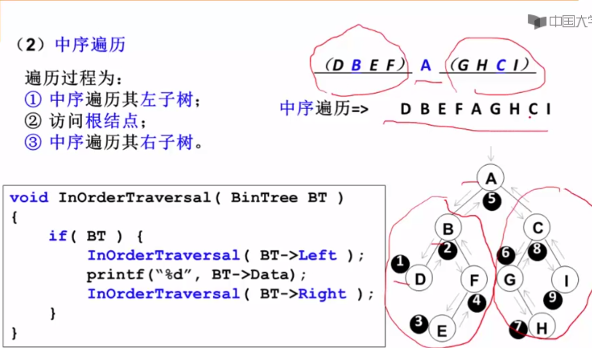
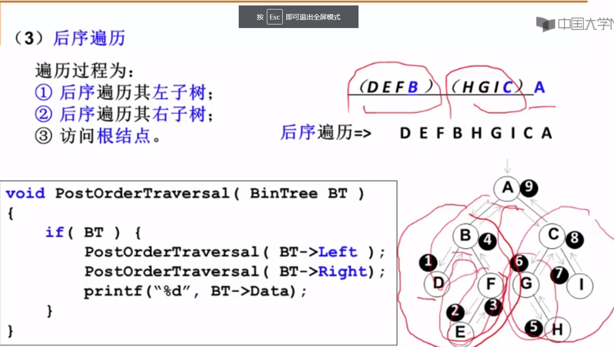
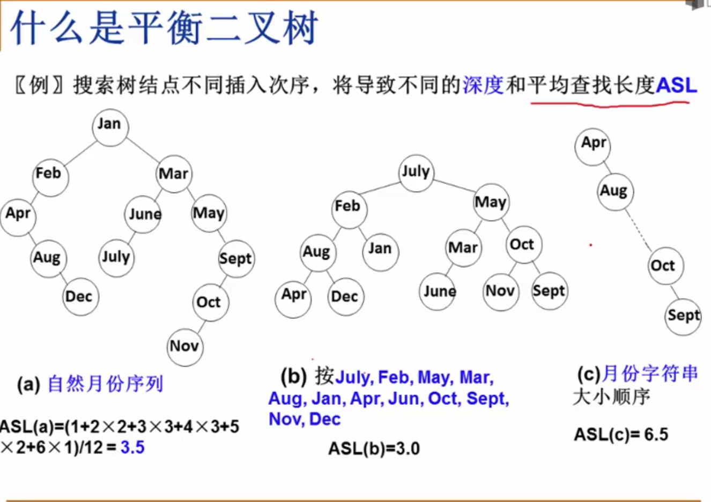
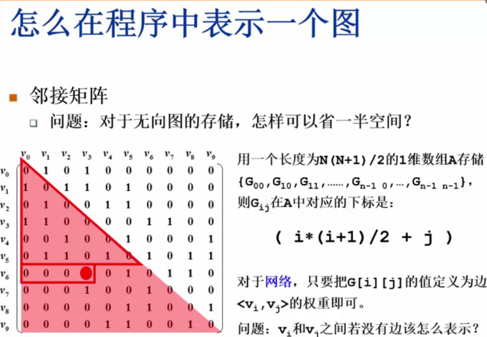

# Python
0. **_Python Built-In modules_**:
   1. **Itertools**: https://docs.python.org/zh-cn/3/library/itertools.html
   2. **collections**: https://docs.python.org/zh-cn/3/library/collections.html#module-collections

1. 统计list中重复项个数:
    ```
    nums = [1,2,3,4,5,1,1,1,2,2,3]
    from collections import Counter
    d = dict(Counter(nums))
    key = [key for key, value in d.items() if value==2]
    ```
2. **namedtuple** 用以构建只有少数属性但是没有方法的对象,比如数据库条目
3. Python 内置的**complex**类可以用来表示二维向量,但我们这个自定义的类可以扩展到 n 维向量
4.  - **\_\_repr__()** 字符串表示形式,默认情况下,它会返回当前对象的“类名+object at+内存地址”,而如果对该方法进行重写,可以为其制作自定义的自我描述信息。
    - \_\_repr__ 和 \_\_str__ 的区别在于,后者是在 str() 函数被使用,或是在用 print 函数打印一个对象的时候才被调用的,并且它返回的字符串对终端用户更友好。
    - 如果你只想实现这两个特殊方法中的一个,\_\_repr__ 是更好的选择,因为如果一个对象没有 \_\_str__ 函数,而 Python 又需要调用它的时候,解释器会用 \_\_repr__ 作为替代。
    - Difference between \_\_str__ and \_\_repr__ in Python [Stack Overflow](http://stackoverflow.com/questions/1436703/differencebetween-str-and-repr-in-python) 是 Stack Overflow 上的一个问题
    - 前者方便我们调试和记录日志,后者则是给终端用户看的 
5. math.**hypot**() 返回欧几里德范数 `sqrt(x\*x + y\*y)`
6. Python特殊方法 [Data Model](https://docs.python.org/3/reference/datamodel.html) 列出了83 个特殊方法的名字,其中 47 个用于实现算术运算、位运算和比较操作
7. GIL 的全称是 Global Interpreter Lock(全局解释器锁), 多进程,多线程,进程池
   - ***多线程***,`threading.Thread()` or 重写threading.Thread类
     - `join`函数使得主线程等到子线程结束时才退出
     - 线程之间数据共享的, `threading.Lock()` 创建互斥锁
        ```
         # 创建锁
         mutex = threading.Lock()
         # 锁定
         mutex.acquire([timeout])
         # 释放
         mutex.release()
       ```
     - 同一线程中多次请求同一资源的需求,使用**可重入锁**(RLock)(递归锁) `mutex = threading.RLock()`, RLock内部维护着一个Lock和一个counter变量,counter 记录了 acquire 的次数,从而使得资源可以被多次 require
     - **定时器** 规定函数在多少秒后执行某个操作,需要用到Timer类
         ```
         from threading import Timer
     
        def show():
            print("Pyhton")
    
        # 指定一秒钟之后执行 show 函数
        t = Timer(1, hello)
        t.start()  
        ```
     - **守护线程**  主线程执行完毕,不管子线程是否执行完毕都随着主线程一起结束,`setDaemon(bool)`函数,它跟`join`函数是相反的
   - ***多进程*** `muiltprocessing.Process` or 继承 muiltprocessing.Process,重写`run`方法
     - 多进程通讯,进程之间不共享数据的
       - `Queue` 多进程安全的队列,`put` 和 `get`
       - `Pipe` 管道数据传递, `send()` 和`recv()`函数
   - ***进程池*** `Pool`

        | 方法            | 含义                                                        |
        |:----------------|:------------------------------------------------------------|
        | `apply()`       | 同步执行（串行）                                             |
        | `apply_async()` | 异步执行（并行）                                             |
        | `terminate()`   | 立刻关闭进程池                                               |
        | `join()`        | 主进程等待所有子进程执行完毕。必须在close或terminate()之后使用 |
        | `close()`       | 等待所有进程结束后,才关闭进程池                              |
   - ***选择多线程还是多进程？***
     - 多进程 - CPU密集型：程序比较偏重于计算,需要经常使用 CPU 来运算。例如科学计算的程序,机器学习的程序等。
     - 多线程 - I/O密集型：程序需要频繁进行输入输出操作。爬虫程序就是典型的 I/O 密集型程序。
8. ***单例模式***
   1. decorator(装饰器)
        ```
        def singleton(class_):
            instances = {}
            def getinstance(*args, **kwargs):
                if class_ not in instances:
                    instances[class_] = class_(*args, **kwargs)
                return instances[class_]
            return getinstance
        
        @singleton
        class MyClass(BaseClass):
            pass
        ```
   2. base class(基类)
      ```
      class Singleton(object):
        _instance = None
        def __new__(class_, *args, **kwargs):
            if not isinstance(class_._instance, class_):
                class_._instance = object.__new__(class_, *args, **kwargs)
            return class_._instance

       classs MyClass(Singleton, BaseClass):
            pass
      ```
   3. metaclass(元类,超类)
       ```
        class Singleton(type):
            _instances = {}
            def __call__(cls, *args, **kwargs):
                if cls not in cls._instances:
                    cls._instances[cls] = super(Singleton, cls).__call__(*args, **kwargs)
                return cls._instances[cls]

        #Python2
        class MyClass(BaseClass):
            __metaclass__ = Singleton
        
        #Python3
        class MyClass(BaseClass, metaclass=Singleton):
            pass
       ```
9. 不可变数据类型：数值型、字符串型string和元组tuple 可变数据类型：列表list和字典dict
10. `filter()` 函数用于过滤序列, 参数一为函数,参数二为序列
11. `a=(1,)` `b=(1)` `c=("1")` 分别是`tuple` `int` `str`
12. 合并两个list, 直接相加 `+`(有返回值) or `list1.extend(list2)`(没有返回值)
13. 数据库优化查询方法:
    1. 选取最适用的字段属性
    2. 使用连接(JOIN)来代替子查询(Sub-Queries) - Mysql 不会创建临时表
    3. 使用联合(UNION)来代替手动创建的临时表 - 用UNION作为关键字把多个select语句连接起来
    4. 事务 作用是：要么语句块中每条语句都操作成功,要么都失败. 保证数据的一致性和完整性, 事物以BEGIN关键字开始,COMMIT关键字结束
        - 事务的ACID四个特性。也即：原子性,一致性,隔离性,持久性
        - 在事务执行的过程中,数据库将会被锁定
    5. 锁定表
    6. 外键
    7. 索引 应建立在那些将用于JOIN,WHERE判断和ORDERBY排序的字段上
    8. 优化查询语句
       1. 最好是在相同类型的字段间进行比较的操作
       2. 建有索引的字段上尽量不要使用函数进行操作
       3. 在搜索字符型字段时,我们有时会使用LIKE关键字和通配符,这种做法虽然简单,但却也是以牺牲系统性能为代价的

14. `Django`的`orm`(Object-Relation Mapping, 对象关系映射)
    - **ORM优势**
    1. 只需要面向对象编程, 不需要面向数据库编写代码.
       1. 对数据库的操作都转化成对类属性和方法的操作.
       2. 不用编写各种数据库的sql语句.
    2. 实现了数据模型与数据库的解耦, 屏蔽了不同数据库操作上的差异.
       1. 不在关注用的是mysql、oracle...等.
       2. 通过简单的配置就可以轻松更换数据库, 而不需要修改代码.
    - **ORM劣势**
    1. 相比较直接使用SQL语句操作数据库,有性能损失.
    2. 根据对象的操作转换成SQL语句,根据查询的结果转化成对象, 在映射过程中有性能损失.
15. 提高python运行效率：
    1. 使用生成器,节约内存
    2. 避免使用过多的循环
    3. 多线程,多进程,协程
    4. `if else` 中把最先可能发生的放最前面
16. Mysql与Redis区别
    - *redis*：内存型非关系数据库,数据保存在内存中,速度快
    - *mysql*：关系型数据库,数据保存在磁盘中,检索的话,会有一定的Io操作,访问速度相对慢
17. `round()`保留数值小数位数
    ```
    round(10.11111, 2)
    10.11
    ```
18. 字典在内存中是可变数据类型
    ```
    def fun(k, v, dic={}):
        dic[k] = v
        print(dic)
    
    fun("one", 1)
    >>> {"one" : 1}
    fun("two", 2)
    >>> {"one" : 1, "two" : 2}
    fun("three", 3, {})      
    >>> {"three" : 3}
    ```
19. 常见的**HTTP状态码**和意义

    | 分类 | 分类描述                                    |
    |:-----|:-------------------------------------------|
    | 1**  | 信息,服务器收到请求,需要请求者继续执行操作   |
    | 2**  | 成功,操作被成功接收并处理                   |
    | 3**  | 重定向,需要进一步的操作以完成请求            |
    | 4**  | 客户端错误,请求包含语法错误或无法完成请求    |
    | 5**  | 服务器错误,服务器在处理请求的过程中发生了错误 |

20. **前端、后端、数据库阐述web项目的性能优化**
    1. 前端优化
       - 减少http请求、例如制作精灵图
       - html和CSS放在页面上部,javascript放在页面下面,因为js加载比HTML和Css加载慢,所以要优先加载html和css,以防页面显示不全,性能差,也影响用户体验差
    2. 后端优化
       - 缓存存储读写次数高,变化少的数据,比如网站首页的信息、商品的信息等。应用程序读取数据时,一般是先从缓存中读取,如果读取不到或数据已失效,再访问磁盘数据库,并将数据再次写入缓存。
       - 异步方式,如果有耗时操作,可以采用异步,比如celery
       - 代码优化,避免循环和判断次数太多,如果多个if else判断,优先判断最有可能先发生的情况
    3.数据库优化
       - 有条件的话使用redis
       - 建立索引,外键
21. **同源策略**
    1. 协议相同
    2. 端口相同
    3. 域名相同
22. **简述cookie和session的区别**
    1. session 在服务器端,cookie 在客户端（浏览器）
    2. session 的运行依赖 session id,而 session id 是存在 cookie 中的,也就是说,如果浏览器禁用了 cookie ,同时 session 也会失效,存储Session时,键与Cookie中的sessionid相同,值是开发人员设置的键值对信息,进行了base64编码,过期时间由开发人员设置
    3. cookie安全性比session差
23. `any()`:只要迭代器中有一个元素为真就为真;
    `all()`:迭代器中所有的判断项返回都是真,结果才为真
24. `JSON` `json.dumps()`字典转json字符串,`json.loads()` json转字典
25. **python引用计数机制**
    - python垃圾回收主要以**引用计数**为主,**标记-清除**和**分代清除**为辅的机制,其中标记-清除和分代回收主要是为了处理循环引用的难题。
    - del每次减一
26. re匹配中文： [\u4e00-\u9fa5]
27. **乐观锁**和**悲观锁**
    - 悲观锁：拿数据的时候都认为别人会修改,所以每次在拿数据的时候都会上锁
    - 乐观锁：拿数据的时候都认为别人不会修改,所以不会上锁,但是在更新的时候会判断
28. 如果做的是**国际化**软件,那么 _ 可能就不是一个理想的占位符,因为它也是 `gettext.gettext` 函数的常用别名
29. 元组拆包：
    - 使用`*`来处理剩下的元素 
      ```
        >>> a, b, *rest = range(5)
        >>> a, b, rest
        (0, 1, [2, 3, 4])
        >>> a, b, *rest = range(3)
        >>> a, b, rest
        (0, 1, [2])
        >>> a, b, *rest = range(2)
        >>> a, b, rest
        (0, 1, [])
      ```
30. **_切片_**: a:b:c 这种用法只能作为索引或者下标用在`[]`中来返回一个切片对象：slice(a, b, c). 对seq[start:stop:step] 进行求值的时候,Python 会调用`seq.__getitem__(slice(start, stop, step))`
31. 如果在 a * n 这个语句中,序列 a 里的元素是对其他可变对象的引用的话,你就需要格外注意了,因为这个式子的结果可能
会出乎意料。比如,你想用 `my_list = [[]] * 3` 来初始化一个由列表组成的列表,但是你得到的列表里包含的 3 个元素其实是 3
个引用,而且这 3 个引用**指向的都是同一个列表**。这可能不是你想要的效果。
32. 蔡勒公式:计算星期的公式
    - 1582年10月4日后：w = y1+(y1/4)+(c/4)-2*c+(26*(m+1)/10)+d-1;
    - 1582年10月4日前：w = y1+y/4+c/4-2*c+13*(m+1)/5+d+2;
33. Python调用C动态链接库<br/>
    直接打包成so, 再使用python的ctypes调用即可.
    1. C语言文件：pycall.c
    2. gcc编译生成动态库libpycall.so：gcc -o libpycall.so -shared -fPIC pycall.c.
    3. Python调用动态库文件：pycall.py
    ```
    import ctypes  
    ll = ctypes.cdll.LoadLibrary   
    lib = ll("./libpycall.so")    
    lib.foo(1, 3)  
    print('***finish***')  
    ```
34. Python is 与== 区别:
    - is 用于判断两个变量引用对象是否为同一个, a is b 相当于id(a)==id(b),id() 能够获取对象的内存地址
    - == 用于判断引用变量的值是否相等
35. 元组tuple是不自由的，数据不能更改，但是和list一样具有序列，可以用索引和切片   
    set集合是无序的，不重复的，和字典类似也是使用中括号{}表示


# Linux
1. Linux中进程的状态: 
    - 不可中断状态: 睡眠状态,但是此刻进程是不可中断的
    - 暂停/中断状态
    - 就绪状态
    - 运行状态
    - 可中断睡眠状态
    - 僵尸
    - 退出状态
2. 后台运行: &, 后台任务: job -l
3. 当按下Ctrl-c时发生了什么
    1. 终端产生 SIGINT 信号
    2. 前台进程组中的所有进程都会接收到 SIGINT 信号然后退出(默认动作)
    3. shell通过调用 waitpid 清理进程表中子进程信息


# 网络
1. TCP:
    - 特性
        1. 面向连接的、可靠的字节流服务
        2. 仅有两方进行彼此通信, 广播和多播不能用于 TCP
        3. 校验和,确认和重传机制来保证可靠传输
        4. 给数据分节进行排序,并使用累积确认保证数据的顺序不变和非重复<br/>
        **node**: TCP 并不能保证数据一定会被对方接收到,因为这是不可能的。
           如果有可能,就把数据递送到接收方,否则就（通过*放弃重传*并且*中断连接*这一手段）通知用户。
           因此准确说 TCP 也不是 *100% 可靠*的协议,它所能提供的是*数据的可靠递送*或*故障的可靠通知*。
    - *三次握手*
        1. 第一次握手(SYN=1, seq=x):<br/>
           客户端发送一个 TCP 的 SYN 标志位置1的包,指明客户端打算连接的服务器的端口,以及初始序号 X,保存在包头的序列号(Sequence Number)字段里。
            发送完毕后,客户端进入 SYN_SEND 状态。<br/>
        2. 第二次握手(SYN=1, ACK=1, seq=y, ACKnum=x+1):<br/>
            服务器发回确认包(ACK)应答。即 SYN 标志位和 ACK 标志位均为1。
            服务器端选择自己 ISN 序列号,放到 Seq 域里,
            同时将确认序号(ACK)设置为客户的 ISN 加1,即X+1。 
            发送完毕后,服务器端进入 SYN_RCVD 状态。
        3. 第三次握手(ACK=1,ACKnum=y+1)<br/>
            客户端再次发送确认包(ACK),SYN 标志位为0,ACK 标志位为1,
            并且把服务器发来 ACK 的序号字段+1,放在确定字段中发送给对方,并且在数据段放写ISN的+1
            发送完毕后,客户端进入 ESTABLISHED 状态,
            当服务器端接收到这个包时,也进入 ESTABLISHED 状态,TCP 握手结束。
    - *四次挥手*
        1. 第一次挥手(FIN=1,seq=x)<br/>
            假设客户端想要关闭连接,客户端发送一个 FIN 标志位置为1的包,表示自己已经没有数据可以发送了,但是仍然可以接受数据。
            发送完毕后,客户端进入 FIN_WAIT_1 状态。
        2. 第二次挥手(ACK=1,ACKnum=x+1)<br/>
            服务器端确认客户端的 FIN 包,发送一个确认包,表明自己接受到了客户端关闭连接的请求,但还没有准备好关闭连接。
            发送完毕后,服务器端进入 CLOSE_WAIT 状态,客户端接收到这个确认包之后,进入 FIN_WAIT_2 状态,等待服务器端关闭连接。
        3. 第三次挥手(FIN=1,seq=y)<br/>
            服务器端准备好关闭连接时,向客户端发送结束连接请求,FIN 置为1。
            发送完毕后,服务器端进入 LAST_ACK 状态,等待来自客户端的最后一个ACK。
        4. 第四次挥手(ACK=1,ACKnum=y+1)<br/>
            客户端接收到来自服务器端的关闭请求,发送一个确认包,并进入 TIME_WAIT状态,等待可能出现的要求重传的 ACK 包。
            服务器端接收到这个确认包之后,关闭连接,进入 CLOSED 状态。
            客户端等待了某个固定时间（两个最大段生命周期,2MSL,2 Maximum Segment Lifetime）之后,没有收到服务器端的 ACK ,认为服务器端已经正常关闭连接,于是自己也关闭连接,进入 CLOSED 状态。 
    - SYN 攻击<br/>
        攻击客户端在短时间内伪造大量不存在的IP地址,向服务器不断地发送SYN包,服务器回复确认包,并等待客户的确认。
        由于源地址是不存在的,服务器需要不断的重发直至超时,这些伪造的SYN包将长时间占用未连接队列,
        正常的SYN请求被丢弃,导致目标系统运行缓慢,严重者会引起网络堵塞甚至系统瘫痪。
    - 检测 SYN 攻击<br/>
        服务器上看到大量的半连接状态时,特别是源IP地址是随机的,基本上可以断定这是一次SYN攻击。
        在 Linux/Unix 上可以使用系统自带的 netstats 命令来检测 SYN 攻击。
    - SYN 攻击<br/>
        SYN攻击不能完全被阻止,除非将TCP协议重新设计。
        我们所做的是尽可能的减轻SYN攻击的危害,常见的防御 SYN 攻击的方法有如下几种：
        1. 缩短超时（SYN Timeout）时间
        2. 增加最大半连接数
        3. 过滤网关防护
        4. SYN cookies技术

2. UDP<br/>
    UDP 是一个简单的传输层协议。和 TCP 相比,UDP 有下面几个显著特性：

    1. UDP 缺乏可靠性。UDP 本身不提供确认,序列号,超时重传等机制。
       UDP 数据报可能在网络中被复制,被重新排序。
       即 UDP 不保证数据报会到达其最终目的地,也不保证各个数据报的先后顺序,也不保证每个数据报只到达一次
    2. UDP 数据报是有长度的。
       每个 UDP 数据报都有长度,如果一个数据报正确地到达目的地,那么该数据报的长度将随数据一起传递给接收方。而 TCP 是一个字节流协议,没有任何（协议上的）记录边界。
    3. UDP 是无连接的。UDP 客户和服务器之前不必存在长期的关系。
       UDP 发送数据报之前也不需要经过握手创建连接的过程。
    4. UDP 支持多播和广播。


# 数据库

## MySQL
1. 主从复制(Master-Slave)<br/>
    Mysql的复制 Replication 是一个异步的复制过程,从一个 Mysql instace(我们称之为 Master)复制到另一个 Mysql instance(我们称之 Slave)。
    在 Master 与 Slave 之间的实现整个复制过程主要由三个线程来完成,其中两个线程(Sql线程和IO线程)在 Slave 端,另外一个线程(IO线程)在 Master 端。


# **Web编程** WSGI,Django,Flask and Tornado
1. **C/S** and **B/S**
   - CS：客户端、服务器之间需要使用Socket,约定协议,版本（往往是用TCP或UDP）,指定地址和端口。数据可以有一定格式,双方约定好
   - BS: Browser浏览器,特殊的客户端,支持http(s)协议,通过URL向服务器发起请求,等待服务器返回HTML
        - HTTP协议基于TCP协议
2. HTTP协议
    1. 无状态：同一客户端的两次请求之间没有任何关系,从服务器端角度来看,他不知道这两次请求来自同一客户端。
       - 解决无状态：Cookie and Session
    2. 80端口,HTTPS 443端口
    
    常见传递信息方式：
    1. GET使用Query String
        通过查询字符串在URL中传递参数
    2. POST提交数据
        使用表单提交数据
       
    - 无状态：服务器无法知道2次请求之间的联系,通过cookie和session来判断
    - 有连接：基于TCP协议,面向连接的,需要3次握手、4次断开
    - 短链接：Http1.1之前是一个请求一个连接,Tcp创建销毁成本高;Http1.1之后支持keep-alive,默认开启,一个连接打开后,会保持一段时间(可设置),减轻服务器压力

3. Cookie
    - 解决HTTP无状态问题 
    - 保存登陆信息,明文保存,明文传输。浏览器支持压缩传输,但是可以解压缩。
    1. 键值对信息
    2. 浏览器发起每一次请求,都会把cookie信息发给服务器端
    3. 是一种客户端、服务器端传递数据的技术
    4. 服务器可以通过判断这些信息,来确定这次请求是否和之前的有关联
    5. 由服务器产生发给客户端
    6. 客户端可以自己配置Cookie信息
4. URL
    - 统一资源定位符
    - schema://host[:port#]/path/.../[;url-params][?query-string][#anchor]
        1. schema 模式、协议:
           http, ftp, https, mailto等 mysql等
        2. `host:port`: 域名会使用DNS解析,域名会解析成IP 
5. HTTP消息：<br/>
    消息分为Request, Response
    - Request: 浏览器向服务器发起的请求
    - Response: 服务器对客户端发起的请求
    
    请求和响应都由`请求行`,`Header消息报头`,`Body消息正文`组成
   
    1. 请求
    - 请求消息行：请求方法Method 请求路径 协议版本CRLF
    
6. **wsgi**: 指定了web服务器和Python web应用或web框架之间的标准接口,以提高web应用在一系列web服务器间的移植性
    - Web程序必须有一个可调用对象,且该可调用对象接收两个参数,返回一个可迭代对象：
        1. environ：字典,包含请求的所有信息
        2. start_response：在可调用对象中调用的函数,用来发起响应,参数包括状态码,headers等
    
7. Django生命周期
    默认7个中间件
    
    
# 测试
1. 软件测试性: 
    - 可观察: 能否容易的观察程序的行为、输入和输出
    - 可追踪: 能否容易的跟踪程序的操作、状态、性能、错误、GUI事件以及通信情况
    - 可控制: 能否容易的控制程序的行为、输入和输出
    - 可理解: 提供了足够的信息,易于获取、易于理解

## 自动化测试
1. **分层测试**(分层自动化测试)<br/>
    单元测试 -> API测试 -> UI测试<br/>
    白盒测试, 性能测试
2. **回归测试**是指修改了旧代码后,重新进行测试以确认修改没有引入新的错误或导致其他代码产生错误。自动回归测试将大幅降低系统测试、维护升级等阶段的成本
3. 保障测试的**充分度**
    - 覆盖显性需求: 需求文档已经标注清楚的功能一定要全部覆盖
    - 获取隐含需求: 
    - 合理使用合适的用例设计方法:
        1. **典型问题**：典型问题极具代表性,比如查询功能中的日期范围问题,比如输入为空的判断；
        2. **出现频率高的问题**：每次项目的测试报告中对高频率的 Bug 进行收集和分析；
        3. **线上遗漏问题**：客户遗漏问题,往往是测试过程中忽略的问题,极具参考价值,对于测试范围、用例设计的改进有很大的意义。
    - 用例评审: 制度性的方案,用例评审一般是需求、开发和测试三方参与
        1. 测试思路: 避免后期测试过程中方向性的错误
        2. 覆盖度: 不同的角度来提高用例的覆盖度
        3. 不同人员负责模块交叉部分: 检查被忽略的需求点
4. 设计自动化**测试用例**
    1. 不是所有的手工用例都要转为自动化测试用例
    2. 不要流程太复杂的用例,如需,拆分
    3. 用例最好可以构成场景
    4. 用例要带有目的性: 部分是用例做冒烟测试
    5. 用例要是重复执行、繁琐的部分
    6. 用例是主题流程
    7. 构建复杂数据,重复机械式动作
5. **测试数据**获取
    1. 基于GUI操作生成测试数据 
       
        例如创建用户, 每次GUI测试创建一个新用户
       
        _优点_: 
        1. 简单直接
        2. 数据来源于真实的业务流程, 保证正确性
       
        _缺点_:
        1. 效率低: 耗时, 每次一条数据
        2. 不适合封装成测试数据工具
        3. 成功率受限于 GUI 自动化执行的稳定性
        4. 引入不必要的测试依赖: 注册新用户依赖于注册用户流程
    2. 通过API调用生成测试数据
       
        主流的测试数据生成方法. 创建新用户相当于使用createUser 这个API.
       
        _优点_: 
        1. 保证创建的测试数据的准确性
        2. 效率高
        3. 可以封装测试数据函数
        4. 测试数据的创建可以完全依赖于 API 调用
        
        _缺点_：
        1. 涉及数据库的增删改查操作时需要另外加入增删改查的函数进行辅助
        2. 一条产品线会涉及多个API的调用
        3. 对于需要批量创建海量数据的场景,还是会力不从心
    
    3. 数据库操作
       
        创建数据需要用到的 SQL 语句封装成一个个的测试数据准备函数
        
        _优点_:
        1. 生成效率非常高,可以在较短的时间内创建大批量的测试数据
        _缺点_:
        1. API修改多张表, 数据库表关联, 需要花时间定位
        2. 容易出现数据不完整的情况, 附表修改 
        3. 业务逻辑变化, 需要维护更新函数
    
    4. 综合运用 API 和数据库的方式生成测试数据
    
        先通过 API 调用生成基础的测试数据,然后使用数据库的 CRUD 操作生成符合特殊测试需求的数据
6. Pytest并行执行: pytest-xdist: `pytest -n auto *.py` (Jenkins ?)
7. 分布式测试: conductor: 基于socket, 基于UI: Selenium Grid
8. 性能测试工具: locustio
9. PO模式<br/>
    PO指的是Page Object, 是一种设计思想, 把一个页面当作一个对象, 页面和对象之间操作方法就是对象的属性和行为, 三层架构:
        1. 基础封装层 BasePage
        2. PO页面对象层
        3. TestCase测试用例层

## Jenkins
1. 软件开发生命周期<br/>
    又叫SDLC(Software Development Life Cycle), 集合计划、开发、测试和部署的过程。
    1. 需求分析
    2. 设计
    3. 实现
    4. 测试
    5. 维护
2. 产品发布流程<br/>
    产品设计成型 -> 开发人员开发代码 -> 测试人员测试功能 -> 运维人员发布上线
    - 持续集成(CI)
    - 持续交付(Continuous Delivery)
    - 持续部署(continuous deployment)
3. 敏捷开发<br/>
    - 核心：迭代开发与增量开发
        - 迭代开发：拆分大周期为小周期
        - 增量开发：每个版本都要增加一个用户可以感知的完整功能。按照新增功能来划分迭代
4. 

# 算法
1. 分治法(递归): 将原问题分解为几个规模较小但是类似于原问题的子问题,递归求解这些子问题, 然后再合并这些问题的解来建立原问题的解
    - 分解原问题为若干子问题,这些子问题是原问题的规模最小的实例
    - 解决这些子问题,递归地求解这些子问题。当子问题的规模足够小,就可以直接求解 
    - 合并这些子问题的解成原问题的解
2. 排序<br/>
    - 性质 
        1. 稳定性: 当有两个相等键值的纪录R和S,且在原本的列表中R出现在S之前,在排序过的列表中R也将会是在S之前。
        2. 方法: 插入、交换、选择、合并    
    1. 归并排序: 在归并操作上的一种有效的排序算法, 采用分治法
        - 稳定性: 
        - 时间复杂度: 
    2. 冒泡排序: 重复地走访过要排序的数列，一次比较两个元素
        - 稳定
        - 时间复杂度: 最优 O(n) 其他 O(n^2)
    3. 选择排序: 交换排序算法，和冒泡排序有一定的相似度
        - 数组实现 不稳定, 链表 稳定
        - 时间复杂度: O(n^2)
3. 回溯算法<br/>
    也叫试探法，它是一种系统地搜索问题的解的方法

# 数据结构
## 线性表


## 树
### 树的定义

### 树的常用术语1


1. 二叉树
- 二叉树的定义

- 特殊二叉树

- 二叉树的几个重要性质

- 二叉树的遍历
    - 前序遍历
    
    - 中序遍历
    
    - 后序遍历
    
    - 中序遍历非递归遍历算法
    
    - 层序基本过程
    

2. 二叉搜索树
- 二叉搜索树的定义


3. 平衡二叉树
- 平衡二叉树的定义1

- 平衡二叉树的定义2


## 图(Graph)
### 图定义

- 在程序中表示图

- **_邻接矩阵_** - 好处
  - 直观,简单,好理解
  - 方便检查任意一对顶点间是否存在边
  - 方便找任一顶点的所有“邻接点”（有边直接相邻的顶点）
  - 方便计算任一顶点的“度”（从该点出发的边数为“出度”,指向该点的边数为“入度”）
    - 无向图：对应行（或列）非0元素的个数
    - 有向图：对应行非0元素的个数是“出度”；对应列非0元素的个数是“入度”
- 邻接矩阵 - 有什么不好
  - 浪费空间 - 存稀疏图（点很多而边很少）有大量无效元素
    - 对稠密图（特别是完全图）还是很合算的
  - 浪费时间 - 统计稀疏图中一共多少条边
- **_邻接表_**：G[N]为指针数组,对应矩阵每行一个链表,只存非0元素
    - 对于网络,结构中要增加权重的域
    - 一定要稀疏才合算
  - 方便找任一顶点的所有“邻接点”
    - 节约稀疏图的空间
    - 需要N个头指针 + 2E个结点（每个结点至少两个域）
    - 方便计算任一顶点的“度”？
        - 对无向图： yes
        - 对有向图： 只能计算“出度”；需要构造“逆邻接表”（存指向自己的边）来方便计算“入度”
    - 方便检查任意一对顶点间是否存在边？
        - No

### 图的遍历
- 深度优先搜索(Depth First Search, DFS)
- 广度优先搜索(Breadth First Search, BFS)


