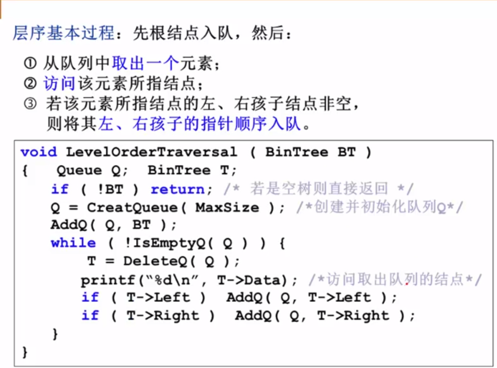
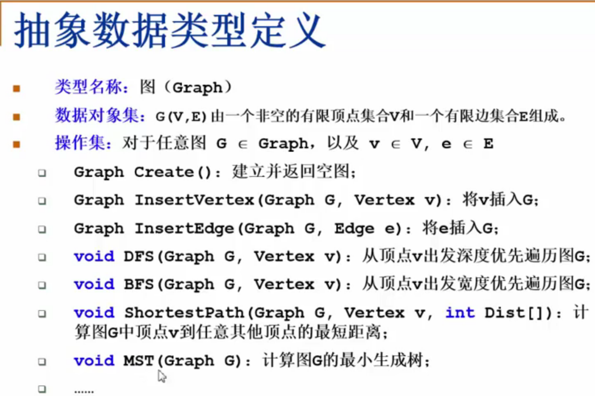

# summary
1. 解决问题的效率，跟空间的利用效率有关
2. 解决问题的效率，跟算法的巧妙程度有关

## 定义
1. 线性表


2. 树
- 树的定义

- 树的常用术语1


2.1 二叉树
- 二叉树的定义

- 特殊二叉树

- 二叉树的几个重要性质

- 二叉树的遍历
    - 前序遍历
    
    - 中序遍历
    
    - 后序遍历
    
    - 中序遍历非递归遍历算法
    
    - 层序基本过程
    

3.1 二叉搜索树
- 二叉搜索树的定义


4.1 平衡二叉树
- 平衡二叉树的定义1

- 平衡二叉树的定义2


6.1 图(Graph)
- 图定义

- 在程序中表示图

- 邻接矩阵 - 好处
  - 直观，简单，好理解
  - 方便检查任意一对顶点间是否存在边
  - 方便找任一顶点的所有“邻接点”（有边直接相邻的顶点）
  - 方便计算任一顶点的“度”（从该点出发的边数为“出度”，指向该点的边数为“入度”）
    - 无向图：对应行（或列）非0元素的个数
    - 有向图：对应行非0元素的个数是“出度”；对应列非0元素的个数是“入度”
- 邻接矩阵 - 有什么不好
  - 浪费空间 - 存稀疏图（点很多而边很少）有大量无效元素
    - 对稠密图（特别是完全图）还是很合算的
    - 

# Python相关
1. 统计list中重复项个数：
```python
nums = [1,2,3,4,5,1,1,1,2,2,3]
from collections import Counter
d = dict(Counter(nums))
key = [key for key, value in d.items() if value==2]
```
2. **namedtuple** 用以构建只有少数属性但是没有方法的对象，比如数据库条目

