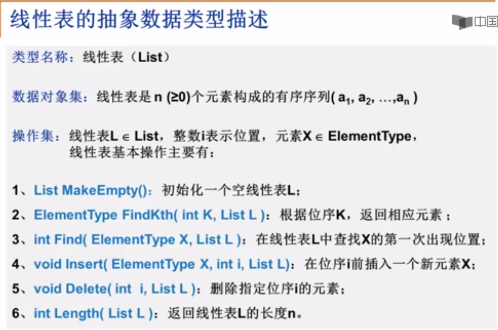
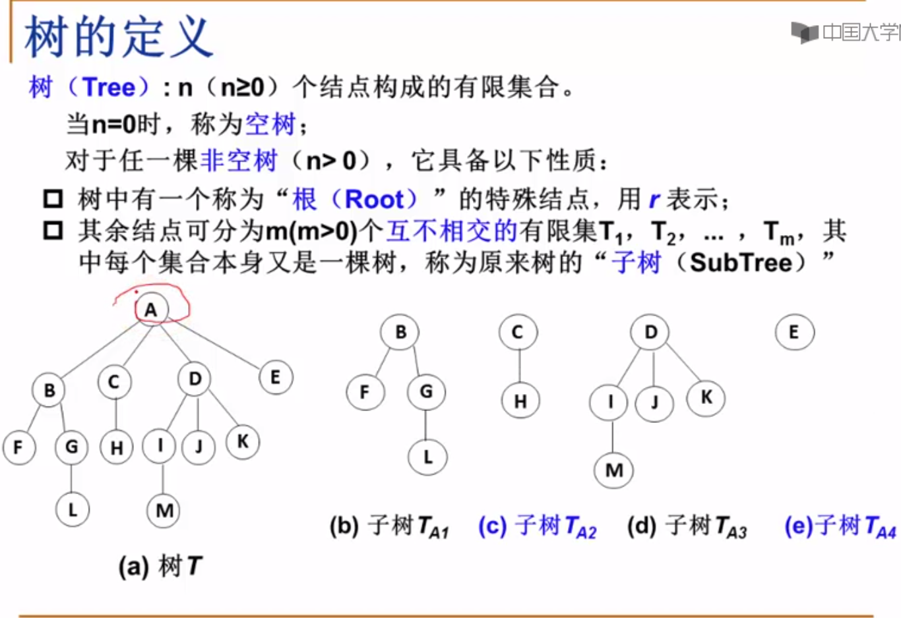
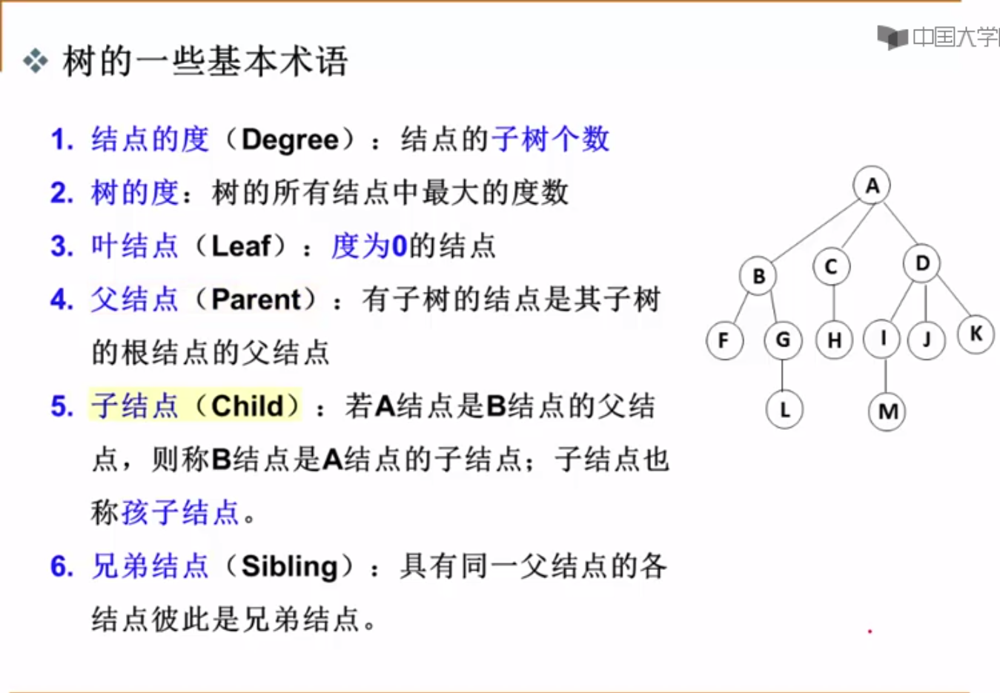
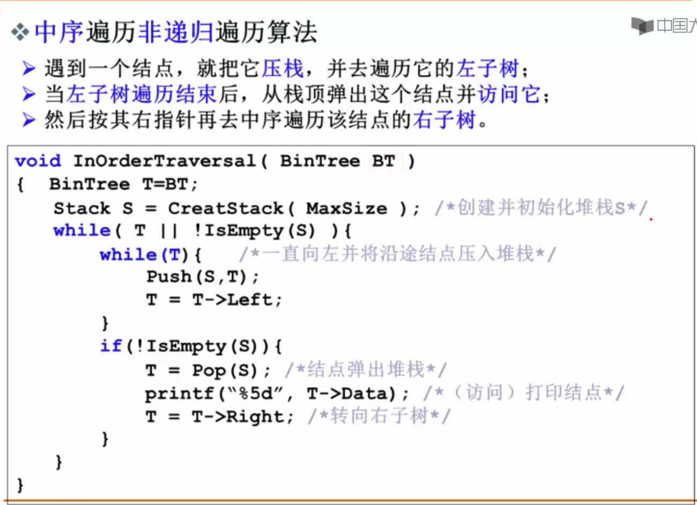

# summary
1. 解决问题的效率，跟空间的利用效率有关
2. 解决问题的效率，跟算法的巧妙程度有关


## 线性表


## 树
### 树的定义

### 树的常用术语1


1. 二叉树
- 二叉树的定义

- 特殊二叉树

- 二叉树的几个重要性质

- 二叉树的遍历
    - 前序遍历
    
    - 中序遍历
    
    - 后序遍历
    
    - 中序遍历非递归遍历算法
    
    - 层序基本过程
    

2. 二叉搜索树
- 二叉搜索树的定义


3. 平衡二叉树
- 平衡二叉树的定义1

- 平衡二叉树的定义2


## 图(Graph)
### 图定义

- 在程序中表示图

- **_邻接矩阵_** - 好处
  - 直观，简单，好理解
  - 方便检查任意一对顶点间是否存在边
  - 方便找任一顶点的所有“邻接点”（有边直接相邻的顶点）
  - 方便计算任一顶点的“度”（从该点出发的边数为“出度”，指向该点的边数为“入度”）
    - 无向图：对应行（或列）非0元素的个数
    - 有向图：对应行非0元素的个数是“出度”；对应列非0元素的个数是“入度”
- 邻接矩阵 - 有什么不好
  - 浪费空间 - 存稀疏图（点很多而边很少）有大量无效元素
    - 对稠密图（特别是完全图）还是很合算的
  - 浪费时间 - 统计稀疏图中一共多少条边
- **_邻接表_**：G[N]为指针数组，对应矩阵每行一个链表，只存非0元素
    - 对于网络，结构中要增加权重的域
    - 一定要稀疏才合算
  - 方便找任一顶点的所有“邻接点”
    - 节约稀疏图的空间
    - 需要N个头指针 + 2E个结点（每个结点至少两个域）
    - 方便计算任一顶点的“度”？
        - 对无向图： yes
        - 对有向图： 只能计算“出度”；需要构造“逆邻接表”（存指向自己的边）来方便计算“入度”
    - 方便检查任意一对顶点间是否存在边？
        - No

### 图的遍历
- 深度优先搜索(Depth First Search, DFS)
- 广度优先搜索(Breadth First Search, BFS)
  
  
# Python相关
1. 统计list中重复项个数:
    ```
    nums = [1,2,3,4,5,1,1,1,2,2,3]
    from collections import Counter
    d = dict(Counter(nums))
    key = [key for key, value in d.items() if value==2]
    ```
2. **namedtuple** 用以构建只有少数属性但是没有方法的对象，比如数据库条目
3. Python 内置的**complex**类可以用来表示二维向量，但我们这个自定义的类可以扩展到 n 维向量
4.  - **\_\_repr__()** 字符串表示形式，默认情况下，它会返回当前对象的“类名+object at+内存地址”，而如果对该方法进行重写，可以为其制作自定义的自我描述信息。
        - \_\_repr__ 和 \_\_str__ 的区别在于，后者是在 str() 函数被使用，或
            是在用 print 函数打印一个对象的时候才被调用的，并且它返回的字
            符串对终端用户更友好。
        - 如果你只想实现这两个特殊方法中的一个，\_\_repr__ 是更好的选择，
            因为如果一个对象没有 \_\_str__ 函数，而 Python 又需要调用它的时
            候，解释器会用 \_\_repr__ 作为替代。
        - Difference between \_\_str__ and \_\_repr__ in Python [Stack Overflow](http://stackoverflow.com/questions/1436703/differencebetween-str-and-repr-in-python) 是 Stack Overflow 上的一个问题 
5. math.**hypot**() 返回欧几里德范数 `sqrt(x\*x + y\*y)`
6. Python特殊方法 [Data Model](https://docs.python.org/3/reference/datamodel.html) 列出了83 个特殊方法的名字，其中 47 个用于实现算术运算、位运算和比较操作
7. GIL 的全称是 Global Interpreter Lock(全局解释器锁), 多进程，多线程，进程池
   - ***多线程***，`threading.Thread()` or 重写threading.Thread类
     - `join`函数使得主线程等到子线程结束时才退出
     - 线程之间数据共享的, `threading.Lock()` 创建互斥锁
        ```
         # 创建锁
         mutex = threading.Lock()
         # 锁定
         mutex.acquire([timeout])
         # 释放
         mutex.release()
       ```
     - 同一线程中多次请求同一资源的需求,使用**可重入锁**(RLock)(递归锁) `mutex = threading.RLock()`, RLock内部维护着一个Lock和一个counter变量，counter 记录了 acquire 的次数，从而使得资源可以被多次 require
     - **定时器** 规定函数在多少秒后执行某个操作，需要用到Timer类
         ```
         from threading import Timer
     
        def show():
            print("Pyhton")
    
        # 指定一秒钟之后执行 show 函数
        t = Timer(1, hello)
        t.start()  
        ```
     - **守护线程**  主线程执行完毕，不管子线程是否执行完毕都随着主线程一起结束，`setDaemon(bool)`函数，它跟`join`函数是相反的
   - ***多进程*** `muiltprocessing.Process` or 继承 muiltprocessing.Process，重写`run`方法
     - 多进程通讯，进程之间不共享数据的
       - `Queue` 多进程安全的队列,`put` 和 `get`
       - `Pipe` 管道数据传递, `send()` 和`recv()`函数
   - ***进程池*** `Pool`

        | 方法            | 含义                                                        |
        |:----------------|:------------------------------------------------------------|
        | `apply()`       | 同步执行（串行）                                             |
        | `apply_async()` | 异步执行（并行）                                             |
        | `terminate()`   | 立刻关闭进程池                                               |
        | `join()`        | 主进程等待所有子进程执行完毕。必须在close或terminate()之后使用 |
        | `close()`       | 等待所有进程结束后，才关闭进程池                              |
   - ***选择多线程还是多进程？***
     - 多进程 - CPU密集型：程序比较偏重于计算，需要经常使用 CPU 来运算。例如科学计算的程序，机器学习的程序等。
     - 多线程 - I/O密集型：程序需要频繁进行输入输出操作。爬虫程序就是典型的 I/O 密集型程序。
8. ***单例模式***
   1. decorator(装饰器)
        ```
        def singleton(class_):
            instances = {}
            def getinstance(*args, **kwargs):
                if class_ not in instances:
                    instances[class_] = class_(*args, **kwargs)
                return instances[class_]
            return getinstance
        
        @singleton
        class MyClass(BaseClass):
            pass
        ```
   2. base class(基类)
      ```
      class Singleton(object):
        _instance = None
        def __new__(class_, *args, **kwargs):
            if not isinstance(class_._instance, class_):
                class_._instance = object.__new__(class_, *args, **kwargs)
            return class_._instance

       classs MyClass(Singleton, BaseClass):
            pass
      ```
   3. metaclass(元类，超类)
       ```
        class Singleton(type):
            _instances = {}
            def __call__(cls, *args, **kwargs):
                if cls not in cls._instances:
                    cls._instances[cls] = super(Singleton, cls).__call__(*args, **kwargs)
                return cls._instances[cls]

        #Python2
        class MyClass(BaseClass):
            __metaclass__ = Singleton
        
        #Python3
        class MyClass(BaseClass, metaclass=Singleton):
            pass
       ```
9. 不可变数据类型：数值型、字符串型string和元组tuple 可变数据类型：列表list和字典dict
10. `filter()` 函数用于过滤序列, 参数一为函数，参数二为序列
11. `a=(1,)` `b=(1)` `c=("1")` 分别是`tuple` `int` `str`
12. 合并两个list, 直接相加 `+`(有返回值) or `list1.extend(list2)`(没有返回值)
13. 数据库优化查询方法:
    1. 选取最适用的字段属性
    2. 使用连接(JOIN)来代替子查询(Sub-Queries) - Mysql 不会创建临时表
    3. 使用联合(UNION)来代替手动创建的临时表 - 用UNION作为关键字把多个select语句连接起来
    4. 事务 作用是：要么语句块中每条语句都操作成功，要么都失败. 保证数据的一致性和完整性， 事物以BEGIN关键字开始，COMMIT关键字结束
        - 事务的ACID四个特性。也即：原子性，一致性，隔离性，持久性
        - 在事务执行的过程中，数据库将会被锁定
    5. 锁定表
    6. 外键
    7. 索引 应建立在那些将用于JOIN,WHERE判断和ORDERBY排序的字段上
    8. 优化查询语句
       1. 最好是在相同类型的字段间进行比较的操作
       2. 建有索引的字段上尽量不要使用函数进行操作
       3. 在搜索字符型字段时，我们有时会使用LIKE关键字和通配符，这种做法虽然简单，但却也是以牺牲系统性能为代价的

14. `Django`的`orm`(Object-Relation Mapping, 对象关系映射)
    - **ORM优势**
    1. 只需要面向对象编程, 不需要面向数据库编写代码.
       1. 对数据库的操作都转化成对类属性和方法的操作.
       2. 不用编写各种数据库的sql语句.
    2. 实现了数据模型与数据库的解耦, 屏蔽了不同数据库操作上的差异.
       1. 不在关注用的是mysql、oracle...等.
       2. 通过简单的配置就可以轻松更换数据库, 而不需要修改代码.
    - **ORM劣势**
    1. 相比较直接使用SQL语句操作数据库,有性能损失.
    2. 根据对象的操作转换成SQL语句,根据查询的结果转化成对象, 在映射过程中有性能损失.
15. 提高python运行效率：
    1. 使用生成器，节约内存
    2. 避免使用过多的循环
    3. 多线程，多进程，协程
    4. `if else` 中把最先可能发生的放最前面
16. Mysql与Redis区别
    - *redis*：内存型非关系数据库，数据保存在内存中，速度快
    - *mysql*：关系型数据库，数据保存在磁盘中，检索的话，会有一定的Io操作，访问速度相对慢
17. `round()`保留数值小数位数
    ```
    round(10.11111, 2)
    10.11
    ```
18. 字典在内存中是可变数据类型
    ```
    def fun(k, v, dic={}):
        dic[k] = v
        print(dic)
    
    fun("one", 1)
    >>> {"one" : 1}
    fun("two", 2)
    >>> {"one" : 1, "two" : 2}
    fun("three", 3, {})      
    >>> {"three" : 3}
    ```
19. 常见的**HTTP状态码**和意义

    | 分类 | 分类描述                                    |
    |:-----|:-------------------------------------------|
    | 1**  | 信息，服务器收到请求，需要请求者继续执行操作   |
    | 2**  | 成功，操作被成功接收并处理                   |
    | 3**  | 重定向，需要进一步的操作以完成请求            |
    | 4**  | 客户端错误，请求包含语法错误或无法完成请求    |
    | 5**  | 服务器错误，服务器在处理请求的过程中发生了错误 |

20. **前端、后端、数据库阐述web项目的性能优化**
    1. 前端优化
       - 减少http请求、例如制作精灵图
       - html和CSS放在页面上部，javascript放在页面下面，因为js加载比HTML和Css加载慢，所以要优先加载html和css,以防页面显示不全，性能差，也影响用户体验差
    2. 后端优化
       - 缓存存储读写次数高，变化少的数据，比如网站首页的信息、商品的信息等。应用程序读取数据时，一般是先从缓存中读取，如果读取不到或数据已失效，再访问磁盘数据库，并将数据再次写入缓存。
       - 异步方式，如果有耗时操作，可以采用异步，比如celery
       - 代码优化，避免循环和判断次数太多，如果多个if else判断，优先判断最有可能先发生的情况
    3.数据库优化
       - 有条件的话使用redis
       - 建立索引，外键
21. **同源策略**
    1. 协议相同
    2. 端口相同
    3. 域名相同
22. **简述cookie和session的区别**
    1. session 在服务器端，cookie 在客户端（浏览器）
    2. session 的运行依赖 session id，而 session id 是存在 cookie 中的，也就是说，如果浏览器禁用了 cookie ，同时 session 也会失效，存储Session时，键与Cookie中的sessionid相同，值是开发人员设置的键值对信息，进行了base64编码，过期时间由开发人员设置
    3. cookie安全性比session差
23. `any()`:只要迭代器中有一个元素为真就为真;
    `all()`:迭代器中所有的判断项返回都是真，结果才为真
24. `JSON` `json.dumps()`字典转json字符串，`json.loads()` json转字典
25. **python引用计数机制**
    - python垃圾回收主要以**引用计数**为主，**标记-清除**和**分代清除**为辅的机制，其中标记-清除和分代回收主要是为了处理循环引用的难题。
    - del每次减一
26. re匹配中文： [\u4e00-\u9fa5]
27. **乐观锁**和**悲观锁**
    - 悲观锁：拿数据的时候都认为别人会修改，所以每次在拿数据的时候都会上锁
    - 乐观锁：拿数据的时候都认为别人不会修改，所以不会上锁，但是在更新的时候会判断
