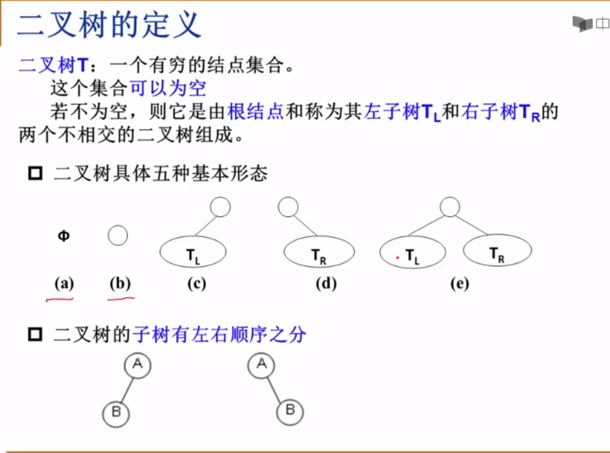
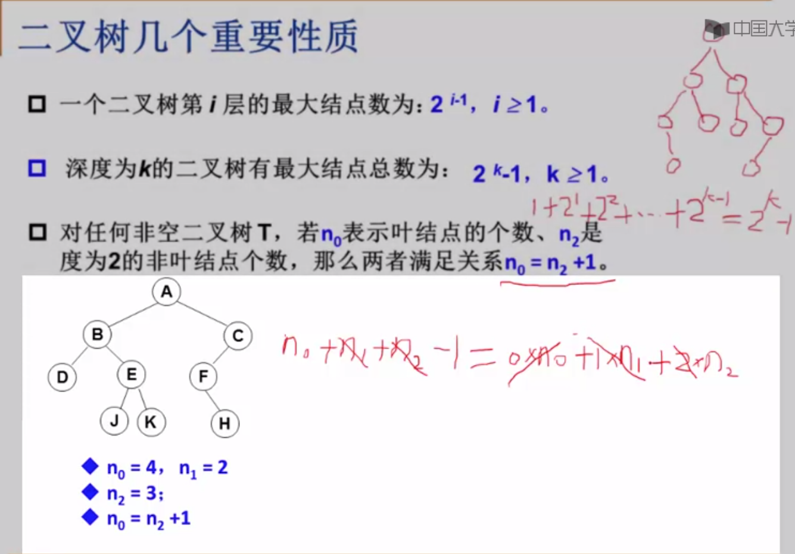
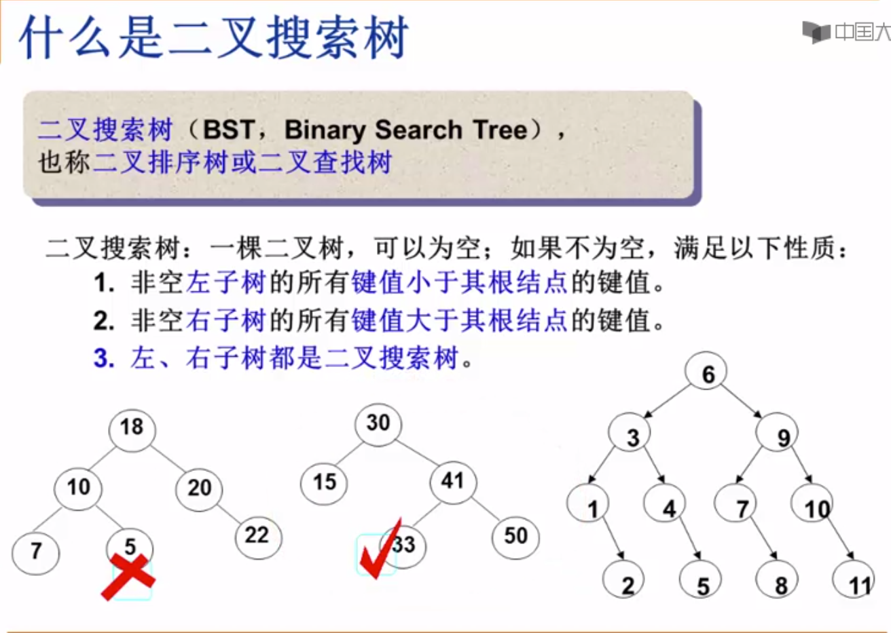
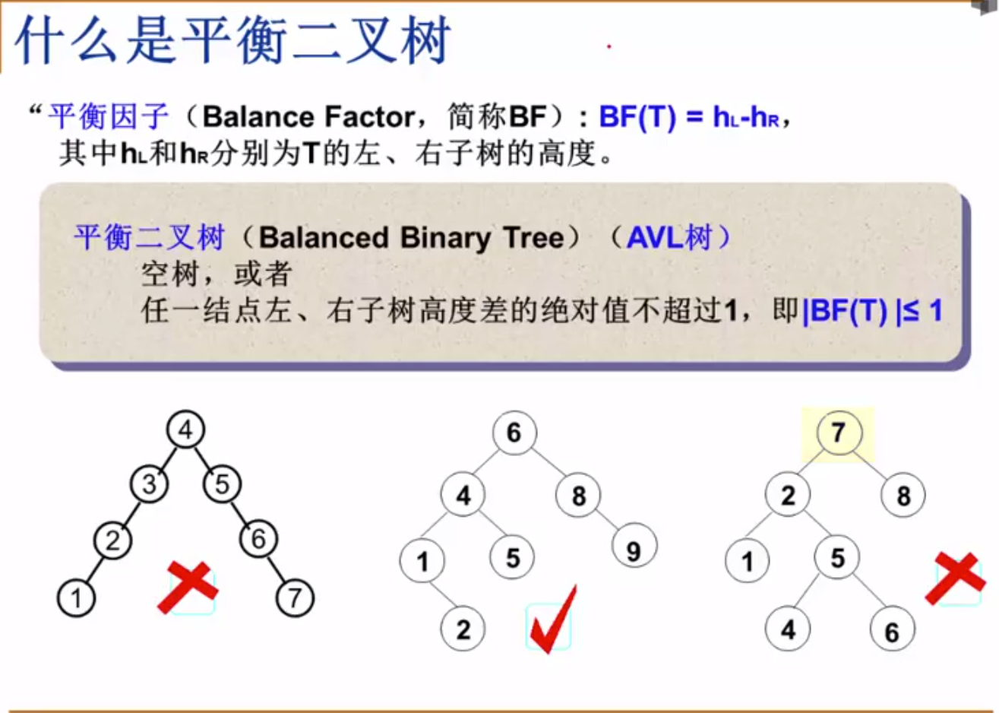

# summary
1. 解决问题的效率，跟空间的利用效率有关
2. 解决问题的效率，跟算法的巧妙程度有关


## 线性表


## 树
### 树的定义

### 树的常用术语1


1. 二叉树
- 二叉树的定义

- 特殊二叉树

- 二叉树的几个重要性质

- 二叉树的遍历
    - 前序遍历
    
    - 中序遍历
    
    - 后序遍历
    
    - 中序遍历非递归遍历算法
    
    - 层序基本过程
    

2. 二叉搜索树
- 二叉搜索树的定义


3. 平衡二叉树
- 平衡二叉树的定义1

- 平衡二叉树的定义2


## 图(Graph)
### 图定义

- 在程序中表示图

- **_邻接矩阵_** - 好处
  - 直观，简单，好理解
  - 方便检查任意一对顶点间是否存在边
  - 方便找任一顶点的所有“邻接点”（有边直接相邻的顶点）
  - 方便计算任一顶点的“度”（从该点出发的边数为“出度”，指向该点的边数为“入度”）
    - 无向图：对应行（或列）非0元素的个数
    - 有向图：对应行非0元素的个数是“出度”；对应列非0元素的个数是“入度”
- 邻接矩阵 - 有什么不好
  - 浪费空间 - 存稀疏图（点很多而边很少）有大量无效元素
    - 对稠密图（特别是完全图）还是很合算的
  - 浪费时间 - 统计稀疏图中一共多少条边
- **_邻接表_**：G[N]为指针数组，对应矩阵每行一个链表，只存非0元素
    - 对于网络，结构中要增加权重的域
    - 一定要稀疏才合算
  - 方便找任一顶点的所有“邻接点”
    - 节约稀疏图的空间
    - 需要N个头指针 + 2E个结点（每个结点至少两个域）
    - 方便计算任一顶点的“度”？
        - 对无向图： yes
        - 对有向图： 只能计算“出度”；需要构造“逆邻接表”（存指向自己的边）来方便计算“入度”
    - 方便检查任意一对顶点间是否存在边？
        - No

### 图的遍历
- 深度优先搜索(Depth First Search, DFS)
- 广度优先搜索(Breadth First Search, BFS)
  
  
# Python相关
1. 统计list中重复项个数:
    ```
    nums = [1,2,3,4,5,1,1,1,2,2,3]
    from collections import Counter
    d = dict(Counter(nums))
    key = [key for key, value in d.items() if value==2]
    ```
2. **namedtuple** 用以构建只有少数属性但是没有方法的对象，比如数据库条目
3. Python 内置的**complex**类可以用来表示二维向量，但我们这个自定义的类可以扩展到 n 维向量
4.  - **\_\_repr__()** 字符串表示形式，默认情况下，它会返回当前对象的“类名+object at+内存地址”，而如果对该方法进行重写，可以为其制作自定义的自我描述信息。
        - \_\_repr__ 和 \_\_str__ 的区别在于，后者是在 str() 函数被使用，或
            是在用 print 函数打印一个对象的时候才被调用的，并且它返回的字
            符串对终端用户更友好。
        - 如果你只想实现这两个特殊方法中的一个，\_\_repr__ 是更好的选择，
            因为如果一个对象没有 \_\_str__ 函数，而 Python 又需要调用它的时
            候，解释器会用 \_\_repr__ 作为替代。
        - Difference between \_\_str__ and \_\_repr__ in Python [Stack Overflow](http://stackoverflow.com/questions/1436703/differencebetween-str-and-repr-in-python) 是 Stack Overflow 上的一个问题 
5. math.**hypot**() 返回欧几里德范数 `sqrt(x\*x + y\*y)`
6. Python特殊方法 [Data Model](https://docs.python.org/3/reference/datamodel.html) 列出了83 个特殊方法的名字，其中 47 个用于实现算术运算、位运算和比较操作
