# Python
0. **_Python Built-In modules_**:
   1. **Itertools**: https://docs.python.org/zh-cn/3/library/itertools.html
   2. **collections**: https://docs.python.org/zh-cn/3/library/collections.html#module-collections

1. 统计list中重复项个数:
    ```
    nums = [1,2,3,4,5,1,1,1,2,2,3]
    from collections import Counter
    d = dict(Counter(nums))
    key = [key for key, value in d.items() if value==2]
    ```
2. **namedtuple** 用以构建只有少数属性但是没有方法的对象,比如数据库条目
3. Python 内置的**complex**类可以用来表示二维向量
4.  - **\_\_repr__()** 字符串表示形式,默认情况下,它会返回当前对象的“类名+object at+内存地址”,而如果对该方法进行重写,可以为其制作自定义的自我描述信息。
    - \_\_repr__ 和 \_\_str__ 的区别在于,后者是在 str() 函数被使用,或是在用 print 函数打印一个对象的时候才被调用的,并且它返回的字符串对终端用户更友好。
    - 如果你只想实现这两个特殊方法中的一个,\_\_repr__ 是更好的选择,因为如果一个对象没有 \_\_str__ 函数,而 Python 又需要调用它的时候,解释器会用 \_\_repr__ 作为替代。
    - Difference between \_\_str__ and \_\_repr__ in Python [Stack Overflow](http://stackoverflow.com/questions/1436703/differencebetween-str-and-repr-in-python) 是 Stack Overflow 上的一个问题
    - 前者方便我们调试和记录日志,后者则是给终端用户看的 
5. math.**hypot**() 返回欧几里德范数 `sqrt(x\*x + y\*y)`
6. Python特殊方法 [Data Model](https://docs.python.org/3/reference/datamodel.html) 列出了83 个特殊方法的名字,其中 47 个用于实现算术运算、位运算和比较操作
7. GIL(全局解释器锁), 进程,线程,协程
   - ***多线程***,`threading.Thread()` or 重写threading.Thread类
     - `join`函数使得主线程等到子线程结束时才退出
     - 线程之间数据共享的, `threading.Lock()` 创建互斥锁
        ```python3
         # 创建锁
         mutex = threading.Lock()
         # 锁定
         mutex.acquire([timeout])
         # 释放
         mutex.release()
       ```
     - 同一线程中多次请求同一资源的需求,使用**可重入锁**(RLock)(递归锁) `mutex = threading.RLock()`, RLock内部维护着一个Lock和一个counter变量,counter 记录了 acquire 的次数,从而使得资源可以被多次 require
     - **定时器** 规定函数在多少秒后执行某个操作,需要用到Timer类
         ```
         from threading import Timer
         def show():
             print("Pyhton")
         # 指定一秒钟之后执行 show 函数
         t = Timer(1, hello)
         t.start()  
         ```
     - **守护线程**  主线程执行完毕,不管子线程是否执行完毕都随着主线程一起结束,`setDaemon(bool)`函数,它跟`join`函数是相反的
   - ***多进程*** `muiltprocessing.Process` or 继承后,重写`run`方法
     - 多进程通讯,进程之间不共享数据的
       - `Queue` 多进程安全的队列,`put` 和 `get`
       - `Pipe` 管道数据传递, `send()` 和`recv()`函数
   - ***进程池*** `Pool`
   
        | 方法            | 含义                                                        |
        |:----------------|:------------------------------------------------------------|
        | `apply()`       | 同步执行（串行）                                             |
        | `apply_async()` | 异步执行（并行）                                             |
        | `terminate()`   | 立刻关闭进程池                                               |
        | `join()`        | 主进程等待所有子进程执行完毕。必须在close或terminate()之后使用 |
        | `close()`       | 等待所有进程结束后,才关闭进程池                              |
   - 协程: 一个线程中的一个个函数叫做子程序,那么子程序在执行过程中可以中断去执行别的子程序, 别的子程序也可以中断回来继续执行之前的子程序()
     - Python通过`yield`提供了对协程的支持,但是不完全.
     - `gevent`是第三方库,通过`greenlet`实现协程
   - 协程vs多线程
     - 协程是一种比线程更加轻量级的存在,最重要的是,协程不被操作系统内核管理,协程是完全由程序控制的。
     - 运行效率极高,协程的切换完全由程序控制,不像线程切换需要花费操作系统的开销,线程数量越多,协程的优势就越明显。
     - 协程没有多线程的锁,因为只有一个线程,不存在变量冲突。
     - 对于多核CPU,利用多进程+协程的方式,能充分利用CPU,获得极高的性能。
   - 多线程vs多进程
     - 多进程 - CPU密集型：程序比较偏重于计算,需要经常使用 CPU 来运算。例如科学计算的程序,机器学习的程序等。
     - 多线程 - I/O密集型：程序需要频繁进行输入输出操作。爬虫程序就是典型的 I/O 密集型程序。
8. ***单例模式***
   1. decorator(装饰器)
        ```
        def singleton(class_):
            instances = {}
            def getinstance(*args, **kwargs):
                if class_ not in instances:
                    instances[class_] = class_(*args, **kwargs)
                return instances[class_]
            return getinstance
        
        @singleton
        class MyClass(BaseClass):
            pass
        ```
   2. base class(基类)
      ```
      class Singleton(object):
        _instance = None
        def __new__(class_, *args, **kwargs):
            if not isinstance(class_._instance, class_):
                class_._instance = object.__new__(class_, *args, **kwargs)
            return class_._instance

       classs MyClass(Singleton, BaseClass):
            pass
      ```
   3. metaclass(元类,超类)
       ```
        class Singleton(type):
            _instances = {}
            def __call__(cls, *args, **kwargs):
                if cls not in cls._instances:
                    cls._instances[cls] = super(Singleton, cls).__call__(*args, **kwargs)
                return cls._instances[cls]

        #Python2
        class MyClass(BaseClass):
            __metaclass__ = Singleton
        
        #Python3
        class MyClass(BaseClass, metaclass=Singleton):
            pass
       ```
    4. 单例模式的优点和应用
    - 优点:
        1. 只有一个实例, 节约内存空间
        2. 只有一个接入点, 更好的进行数据的控制
        3. 可常驻内存, 减少系统开销
    - 应用:
        1. 生成全局唯一的序列号
        2. 访问全局复用的唯一资源, 如磁盘、总线
        3. 单个对象占用的资源过多, 如数据库
        4. 系统全局唯一管理
        5. 网站计数器
        6. 数据库配置, 数据库连接池
        7. 应用程序的日志应用       
9. 不可变数据类型：数值型、字符串型string和元组tuple 可变数据类型：列表list、字典dict、集合set
10. `filter()` 函数用于过滤序列, 参数一为函数,参数二为序列
11. `a=(1,)` `b=(1)` `c=("1")` 分别是`tuple` `int` `str`
12. 合并两个list, 直接相加 `+`(有返回值) or `list1.extend(list2)`(没有返回值)
13. 数据库优化查询方法:
    1. 选取最适用的字段属性
    2. 使用连接(JOIN)来代替子查询(Sub-Queries) - Mysql 不会创建临时表
    3. 使用联合(UNION)来代替手动创建的临时表 - 用UNION作为关键字把多个select语句连接起来
    4. 事务 作用是：要么语句块中每条语句都操作成功,要么都失败. 保证数据的一致性和完整性, 事物以BEGIN关键字开始,COMMIT关键字结束
        - 事务的ACID四个特性。也即：原子性,一致性,隔离性,持久性
        - 在事务执行的过程中,数据库将会被锁定
    5. 锁定表
    6. 外键
    7. 索引 应建立在那些将用于JOIN,WHERE判断和ORDERBY排序的字段上
    8. 优化查询语句
       1. 最好是在相同类型的字段间进行比较的操作
       2. 建有索引的字段上尽量不要使用函数进行操作
       3. 在搜索字符型字段时,我们有时会使用LIKE关键字和通配符,这种做法虽然简单,但却也是以牺牲系统性能为代价的
14. `Django`的`orm`(Object-Relation Mapping, 对象关系映射)
    - **ORM优势**
    1. 只需要面向对象编程, 不需要面向数据库编写代码.
       1. 对数据库的操作都转化成对类属性和方法的操作.
       2. 不用编写各种数据库的sql语句.
    2. 实现了数据模型与数据库的解耦, 屏蔽了不同数据库操作上的差异.
       1. 不在关注用的是mysql、oracle...等.
       2. 通过简单的配置就可以轻松更换数据库, 而不需要修改代码.
    - **ORM劣势**
    1. 相比较直接使用SQL语句操作数据库,有性能损失.
    2. 根据对象的操作转换成SQL语句,根据查询的结果转化成对象, 在映射过程中有性能损失.
15. 提高python运行效率：
    1. 使用生成器,节约内存
    2. 避免使用过多的循环
    3. 多线程,多进程,协程
    4. `if else` 中把最先可能发生的放最前面
16. Mysql与Redis区别
    - *redis*：内存型非关系数据库,数据保存在内存中,速度快
    - *mysql*：关系型数据库,数据保存在磁盘中,检索的话,会有一定的Io操作,访问速度相对慢
17. `round()`保留数值小数位数
    ```
    round(10.11111, 2)
    10.11
    ```
18. 字典在内存中是可变数据类型
    ```
    def fun(k, v, dic={}):
        dic[k] = v
        print(dic)
    
    fun("one", 1)
    >>> {"one" : 1}
    fun("two", 2)
    >>> {"one" : 1, "two" : 2}
    fun("three", 3, {})      
    >>> {"three" : 3}
    ```
19. 常见的**HTTP状态码**和意义

    | 分类 | 分类描述                                    |
    |:-----|:-------------------------------------------|
    | 1**  | 信息,服务器收到请求,需要请求者继续执行操作   |
    | 2**  | 成功,操作被成功接收并处理                   |
    | 3**  | 重定向,需要进一步的操作以完成请求            |
    | 4**  | 客户端错误,请求包含语法错误或无法完成请求    |
    | 5**  | 服务器错误,服务器在处理请求的过程中发生了错误 |

20. **前端、后端、数据库阐述web项目的性能优化**
    1. 前端优化
       - 减少http请求、例如制作精灵图
       - html和CSS放在页面上部,javascript放在页面下面,因为js加载比HTML和Css加载慢,所以要优先加载html和css,以防页面显示不全,性能差,也影响用户体验差
    2. 后端优化
       - 缓存存储读写次数高,变化少的数据,比如网站首页的信息、商品的信息等。应用程序读取数据时,一般是先从缓存中读取,如果读取不到或数据已失效,再访问磁盘数据库,并将数据再次写入缓存。
       - 异步方式,如果有耗时操作,可以采用异步,比如celery
       - 代码优化,避免循环和判断次数太多,如果多个if else判断,优先判断最有可能先发生的情况
    3.数据库优化
       - 有条件的话使用redis
       - 建立索引,外键
21. **同源策略**
    1. 协议相同
    2. 端口相同
    3. 域名相同
22. **简述cookie和session的区别**
    1. session 在服务器端,cookie 在客户端（浏览器）
    2. session 的运行依赖 session id,而 session id 是存在 cookie 中的,也就是说,如果浏览器禁用了 cookie ,同时 session 也会失效,存储Session时,键与Cookie中的sessionid相同,值是开发人员设置的键值对信息,进行了base64编码,过期时间由开发人员设置
    3. cookie安全性比session差
23. `any()`:只要迭代器中有一个元素为真就为真;
    `all()`:迭代器中所有的判断项返回都是真,结果才为真
24. `JSON` `json.dumps()`字典转json字符串,`json.loads()` json转字典
25. **python GC**
    - python垃圾回收主要以**引用计数**为主,**标记-清除**和**分代清除**为辅的机制,其中标记-清除和分代回收主要是为了处理循环引用的难题。
    - del每次减一
    - gc.collect()
26. re匹配中文： [\u4e00-\u9fa5]
27. **乐观锁**和**悲观锁**
    - 悲观锁：拿数据的时候都认为别人会修改,所以每次在拿数据的时候都会上锁
    - 乐观锁：拿数据的时候都认为别人不会修改,所以不会上锁,但是在更新的时候会判断
28. 如果做的是**国际化**软件,那么 _ 可能就不是一个理想的占位符,因为它也是 `gettext.gettext` 函数的常用别名
29. 元组拆包：
    - 使用`*`来处理剩下的元素 
      ```
        >>> a, b, *rest = range(5)
        >>> a, b, rest
        (0, 1, [2, 3, 4])
        >>> a, b, *rest = range(3)
        >>> a, b, rest
        (0, 1, [2])
        >>> a, b, *rest = range(2)
        >>> a, b, rest
        (0, 1, [])
      ```
30. **_切片_**: a:b:c 这种用法只能作为索引或者下标用在`[]`中来返回一个切片对象：slice(a, b, c). 对seq[start:stop:step] 进行求值的时候,Python 会调用`seq.__getitem__(slice(start, stop, step))`
31. 如果在 a * n 这个语句中,序列 a 里的元素是对其他可变对象的引用的话,你就需要格外注意了,因为这个式子的结果可能
会出乎意料。比如,你想用 `my_list = [[]] * 3` 来初始化一个由列表组成的列表,但是你得到的列表里包含的 3 个元素其实是 3
个引用,而且这 3 个引用**指向的都是同一个列表**。这可能不是你想要的效果。
32. 蔡勒公式:计算星期的公式
    - 1582年10月4日后：w = y1+(y1/4)+(c/4)-2*c+(26*(m+1)/10)+d-1;
    - 1582年10月4日前：w = y1+y/4+c/4-2*c+13*(m+1)/5+d+2;
33. Python调用C动态链接库<br/>
    直接打包成so, 再使用python的ctypes调用即可.
    1. C语言文件：pycall.c
    2. gcc编译生成动态库libpycall.so：gcc -o libpycall.so -shared -fPIC pycall.c.
    3. Python调用动态库文件：pycall.py
    ```
    import ctypes  
    ll = ctypes.cdll.LoadLibrary   
    lib = ll("./libpycall.so")    
    lib.foo(1, 3)  
    print('***finish***')  
    ```
34. Python is 与== 区别:
    - is 比较的是*ID*, a is b 相当于id(a)==id(b),id() 能够获取对象的内存地址
    - == 比较的是*值*
35. 元组tuple是不自由的,数据不能更改,但是和list一样具有序列,可以用索引和切片   
    set集合是无序的,不重复的,和字典类似也是使用中括号{}表示
36. **面向对象**
    - 继承:
        1. 查看继承的特殊属性和方法
            - __base__ : 类的基类
            - __based__ : 类的基类元组
            - __mro__ : 显示方法查找顺序,基类的元组
            - mro()方法 ： 显示方法查找顺序,基类的元组
            - __subclasses__() : 类的子类列表
        2. 继承中的访问控制
            - 从父类继承,自己没有的就可以到父类中找
            - 私有的都是不可以访问的,但是本质上依然是改了名称放在这个属性所在类的__dict__中
            - 继承时,公有的,子类和实例都可以随意访问,私有成员被隐藏了,子类和实例不可直接访问
            - 当私有变量所在的类内的方法中可以访问这个私有变量
            - 属性查找属性：实例的dict->类的dict->父类dict
        3. 多继承
            - 类的内置属性`__mro__`查看*方法*搜索顺序, 在多继承时判断 方法、属性 的调用 路径
    - 封装:
        1. 使用 @property 装饰器时,接口名不必与属性名相同.
        2. 凡是赋值语句,就会触发set方法。获取属性值,会触发get方法
    - 多态 
    - 反射: 通过字符串的形式操作对象相关的属性.
        1. 应用场景: 动态加载模块、web框架的URL路由
        - `__import__()` 动态加载模块
        - `hasattr()` 判断实例是否存在字符串对应的属性
        - `getattr()` 获取字符串对应的属性
        - `setattr()` 将字符串对应的已存在的属性添加到实例中
        - `delattr()` 删除实例中字符串对应的属性
    - c3算法:
        - 本地优先级: 声明父类的顺序, C(A, B) 先A再B
        - 单调性: 如果在C的解析顺序中, A排在B的前面, 那么C的所有子类也满足这个顺序
37. 最大公约数: `math.gcd(x, y)`
38. **浅拷贝和深拷贝**
    - 浅拷贝:`b = a.copy()` a 和 b 是一个独立的对象,但他们的子对象还是指向统一对象（是引用）
    - 深拷贝: `b = copy.deepcopy(a)` a 和 b 完全拷贝了父对象及其子对象,两者是完全独立的
39. 打乱一个排好序的list对象alist
    ```python
    alist = [1,2,3]
    import random
    random.shuffle(alist)
    ```
40. Python**递归的最大层数**
    - 998
41. **列表推导式**和**生成器表达式**
    ```python
    [i%2 for i in range(10)]
    # [0, 1, 0, 1, 0, 1, 0, 1, 0, 1] 
    (i%2 for i in range(10))
    # generator
    ```
42. **闭包**
    - 闭包函数: inner函数定义在outer函数的内部, 并且outer函数的返回值是inner函数
    - inner函数必须访问outer函数的变量
    - outer的返回值必须是inner
    - 闭包比普通的函数多了一个`__closure__`属性, 用于获取自由变量(outer定义的参数)
43. Python函数调用的时候参数的传递方式是值传递还是引用传递
    - Python的参数传递有: 位置传递, 默认参数, 可变参数, 关键字参数
    值传递和引用传递:
        1. 不可变参数用**值传递**:
            - 像整数和字符串这样的不可变对象是值传递
        2. 可变对象用**引用传递**:
            - 像列表,字典这样的对象是引用传递,能在函数内部改变
44. with的用法: <br/>
    `with context_expression [as target(s)]` with-body 这里的context_expression 要返回一个上下文管理器
    如果指定了`as`子句, 会将上下文管理器中的`__enter__()`方法的返回值赋值给 `target(s)`, 它可以是单个变量也可以是用`()`括起来的元组
    - 自己实现上下文管理器要实现`__enter__()`和`__exit__()`方法
45. json序列化时默认会将中文转为Unicode
    ```python
    import json
    a = json.dumps({'ddf': '你好'}, ensure_ascii=False)
    print(a) # {"aa": "你好"}
    ```
45. 邮箱正则:
    `r'^[a-zA-Z0-9_-]+@[a-zA-Z0-9_-]+(\.[a-zA-Z0-9_-]+)+$'`
46. Python内存办理:
    - Python内存池机制, Pymalloc机制
47. 利用堆排序
    ```python
    import heapq
    nums = [9,8,7,6,5,4,3,2,1]
    heapq.heapify(nums)
    print([heapq.heappop(nums) for i in range(len(nums))])
    ```
38. `lru_cache` 使用`functools`模块的`lur_cache`装饰器,可以缓存最多_maxsize_个此函数的调用结果,从而提高程序执行的效率,特别适合于耗时的函数。
    参数maxsize为最多缓存的次数,如果为None,则无限制,设置为2n时,性能最佳 
39. 


# 测试
1. 软件测试性: 
    - 可观察: 能否容易的观察程序的行为、输入和输出
    - 可追踪: 能否容易的跟踪程序的操作、状态、性能、错误、GUI事件以及通信情况
    - 可控制: 能否容易的控制程序的行为、输入和输出
    - 可理解: 提供了足够的信息,易于获取、易于理解

## 自动化测试
1. **分层测试**(分层自动化测试)<br/>
    单元测试 -> API测试 -> UI测试<br/>
    白盒测试, 性能测试
2. **回归测试**是指修改了旧代码后,重新进行测试以确认修改没有引入新的错误或导致其他代码产生错误。自动回归测试将大幅降低系统测试、维护升级等阶段的成本
3. 保障测试的**充分度**
    - 覆盖显性需求: 需求文档已经标注清楚的功能一定要全部覆盖
    - 获取隐含需求: 
    - 合理使用合适的用例设计方法:
        1. **典型问题**：典型问题极具代表性,比如查询功能中的日期范围问题,比如输入为空的判断；
        2. **出现频率高的问题**：每次项目的测试报告中对高频率的 Bug 进行收集和分析；
        3. **线上遗漏问题**：客户遗漏问题,往往是测试过程中忽略的问题,极具参考价值,对于测试范围、用例设计的改进有很大的意义。
    - 用例评审: 制度性的方案,用例评审一般是需求、开发和测试三方参与
        1. 测试思路: 避免后期测试过程中方向性的错误
        2. 覆盖度: 不同的角度来提高用例的覆盖度
        3. 不同人员负责模块交叉部分: 检查被忽略的需求点
4. **测试用例**
    1. 不是所有的手工用例都要转为自动化测试用例
    2. 不要流程太复杂的用例,如需,拆分
    3. 用例最好可以构成场景
    4. 用例要带有目的性: 部分是用例做冒烟测试
    5. 用例要是重复执行、繁琐的部分
    6. 用例是主题流程
    7. 构建复杂数据,重复机械式动作
5. **测试数据**获取
    1. 基于GUI操作生成测试数据 
       
        例如创建用户, 每次GUI测试创建一个新用户
       
5. **测试数据** 
    1. 基于GUI操作生成测试数据<br/>
        例如创建用户, 每次GUI测试创建一个新用户<br/>
        _优点_: 
        1. 简单直接
        2. 数据来源于真实的业务流程, 保证正确性<br/>
        _缺点_:
        1. 效率低: 耗时, 每次一条数据
        2. 不适合封装成测试数据工具
        3. 成功率受限于 GUI 自动化执行的稳定性
        4. 引入不必要的测试依赖: 注册新用户依赖于注册用户流程
    2. 通过API调用生成测试数据<br/>
        主流的测试数据生成方法. 创建新用户相当于使用createUser 这个API.<br/>
        _优点_: 
        1. 保证创建的测试数据的准确性
        2. 效率高
        3. 可以封装测试数据函数
        4. 测试数据的创建可以完全依赖于 API 调用<br/>
        _缺点_：
        1. 涉及数据库的增删改查操作时需要另外加入增删改查的函数进行辅助
        2. 一条产品线会涉及多个API的调用
        3. 对于需要批量创建海量数据的场景,还是会力不从心<br/>
    3. 数据库操作<br/>
        创建数据需要用到的 SQL 语句封装成一个个的测试数据准备函数<br/>
        _优点_:
        1. 生成效率非常高,可以在较短的时间内创建大批量的测试数据
        _缺点_:
        1. API修改多张表, 数据库表关联, 需要花时间定位
        2. 容易出现数据不完整的情况, 附表修改 
        3. 业务逻辑变化, 需要维护更新函数
    4. 综合运用 API 和数据库的方式生成测试数据<br/>
        先通过 API 调用生成基础的测试数据,然后使用数据库的 CRUD 操作生成符合特殊测试需求的数据
6. Pytest并行执行: pytest-xdist: `pytest -n auto *.py` (Jenkins ?)
7. 分布式测试: conductor: 基于socket, 基于UI: Selenium Grid
8. PO模式<br/>
    PO指的是Page Object, 是一种设计思想, 把一个页面当作一个对象, 页面和对象之间操作方法就是对象的属性和行为, 三层架构:
        1. 基础封装层 BasePage
        2. PO页面对象层
        3. TestCase测试用例层
9. 性能测试工具: Locust 
10. 在公司中实施并推广自动化测试
    1. 选择自动化测试框架, 演示demo
    2. 搭建自动化测试框架,在项目中逐步开展自动化
    3. 该项目的自动化流程、框架固化成文档
    4. 推广到公司的其它项目组应用
11. 自动化测试流程
    1. 编写自动化测试计划
    2. 设计自动化测试用例
    3. 编写自动化测试框架和脚本
    4. 调试并维护脚本
    5. 无人值守测试
    6. 后期脚本维护（添加用例、开发更新版本）
12. *黑盒测试*的测试方法有：等价类划分、边界值分析法、猜错法、随机数法、因果图。<br/>
    *白盒测试*的测试方法有：代码检查法、程序变异、静态结构分析法、静态质量度量法、符号测试法、逻辑覆盖法、域测试、Z路径覆盖和基本路径测试法。


## Jenkins
1. 软件开发生命周期<br/>
    又叫SDLC(Software Development Life Cycle), 集合计划、开发、测试和部署的过程。
    1. 需求分析
    2. 设计
    3. 实现
    4. 测试
    5. 维护
2. 产品发布流程<br/>
    产品设计成型 -> 开发人员开发代码 -> 测试人员测试功能 -> 运维人员发布上线
    - 持续集成(CI)
    - 持续交付(Continuous Delivery)
    - 持续部署(continuous deployment)
3. 敏捷开发<br/>
    - 核心：迭代开发与增量开发
        - 迭代开发：拆分大周期为小周期
        - 增量开发：每个版本都要增加一个用户可以感知的完整功能。按照新增功能来划分迭代
4. 

# 第三方库
1. selenium
    1. 等待:
        - 隐式等待,直接调用implicitly_wait()方法,传入等待时间,比如implicitly_wait(10),就代表最长等待10秒
        - 显式等待,导入WebDriverWait和expected_conditions包,调用until()者until_not()方法
        - 显式等待比隐式等待更节约执行时间,因此更推荐使用显式等待方式判断页面元素是否存在
    2. selenium中如何判断元素是否存在:
        1. `isElementExist`
        2. `find_element_by_xxx` 加 `try except`
        3. `ele = find_elements` len(ele) = 0 则没找到
    3.  


# 算法
1. 分治法(递归): 将原问题分解为几个规模较小但是类似于原问题的子问题,递归求解这些子问题, 然后再合并这些问题的解来建立原问题的解
    - 分解原问题为若干子问题,这些子问题是原问题的规模最小的实例
    - 解决这些子问题,递归地求解这些子问题。当子问题的规模足够小,就可以直接求解 
    - 合并这些子问题的解成原问题的解
2. 排序<br/>
    - 性质 
        1. 稳定性: 当有两个相等键值的纪录R和S,且在原本的列表中R出现在S之前,在排序过的列表中R也将会是在S之前。
        2. 方法: 插入、交换、选择、合并    
    1. 归并排序: 在归并操作上的一种有效的排序算法, 采用分治法
        - 稳定性: 
        - 时间复杂度: 
    2. 冒泡排序: 重复地走访过要排序的数列,一次比较两个元素
        - 稳定
        - 时间复杂度: 最优 O(n) 其他 O(n^2)
    3. 选择排序: 交换排序算法,和冒泡排序有一定的相似度
        - 数组实现 不稳定, 链表 稳定
        - 时间复杂度: O(n^2)
3. 回溯算法<br/>
    也叫试探法,它是一种系统地搜索问题的解的方法
4. 倒序输出单向链表
    1. 用*栈*倒序输出
    2. 翻转链表, 再顺序输出
    3. _递归实现_, 递归就是一个进栈出栈的过程,链表前面的元素先进栈,在栈底,后面的元素后进栈,在栈顶,先出栈
    4. 数组实现

# 数据结构
## 线性表
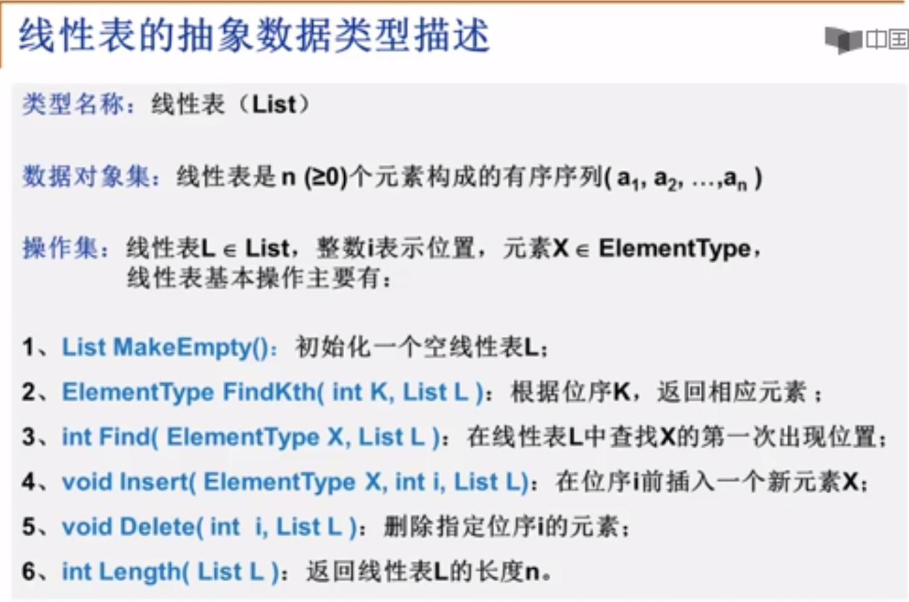

## 树
### 树的定义
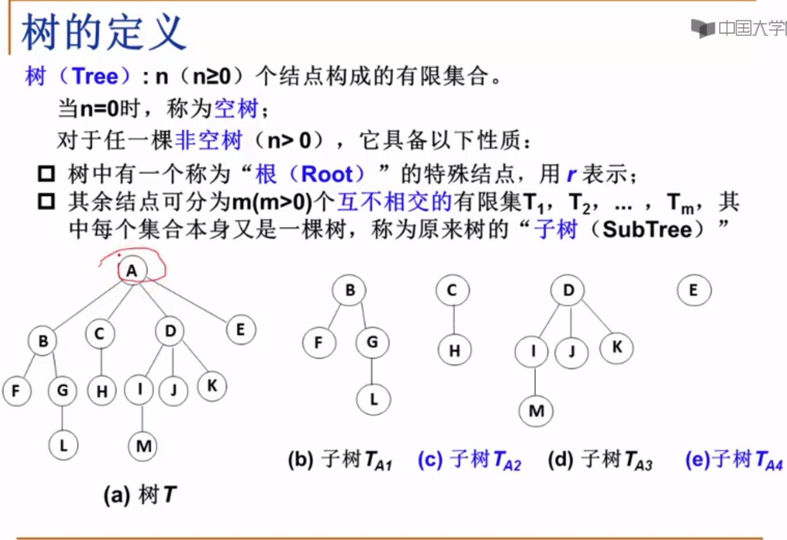
### 树的常用术语1
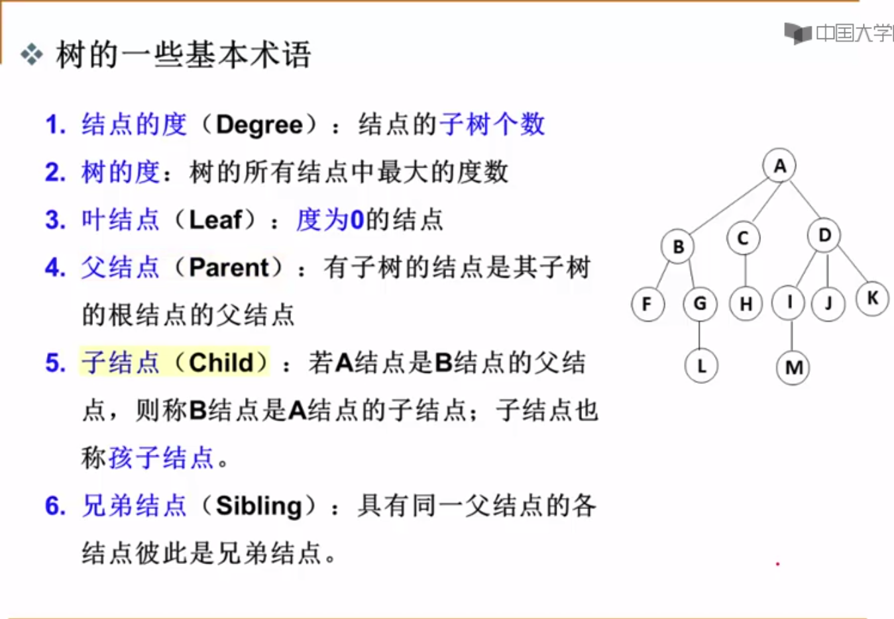

1. 二叉树
- 二叉树的定义
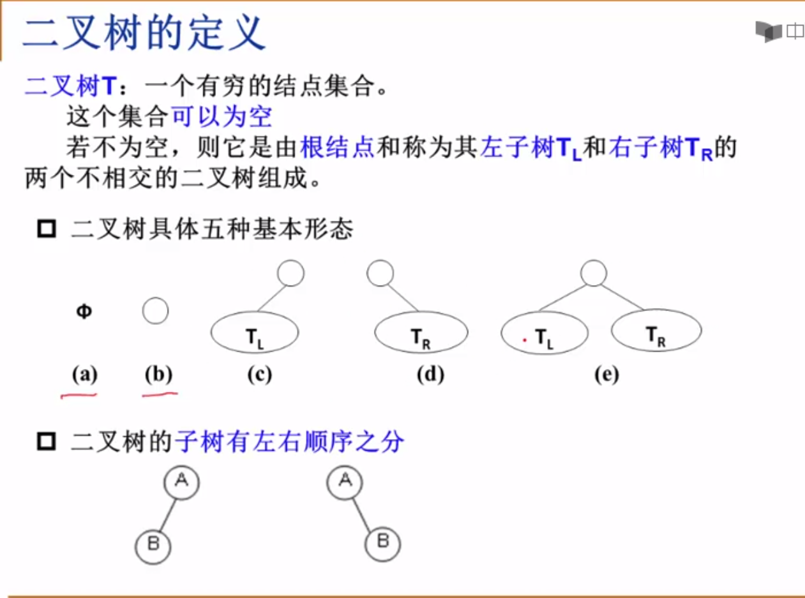
- 特殊二叉树
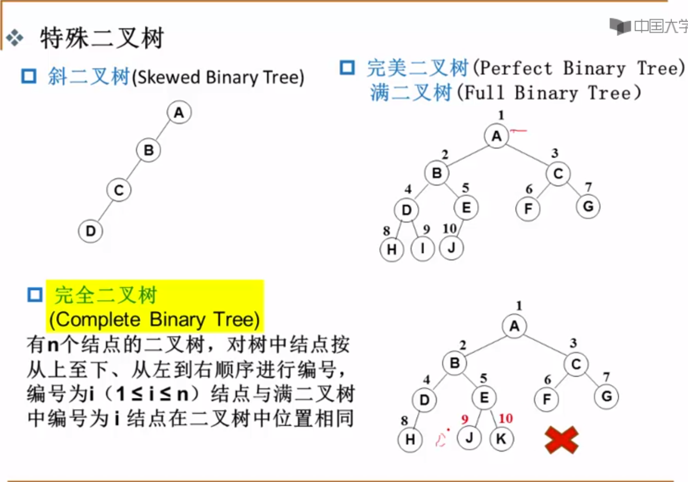
- 二叉树的几个重要性质
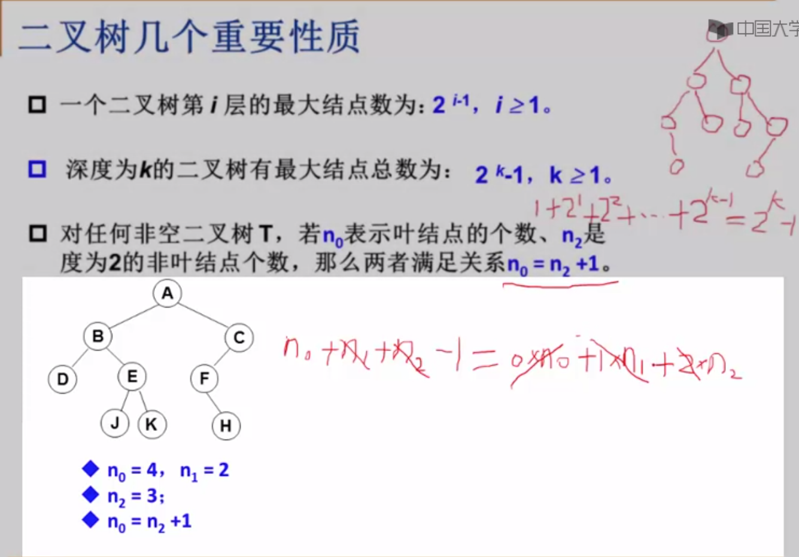
- 二叉树的遍历
    - 前序遍历
    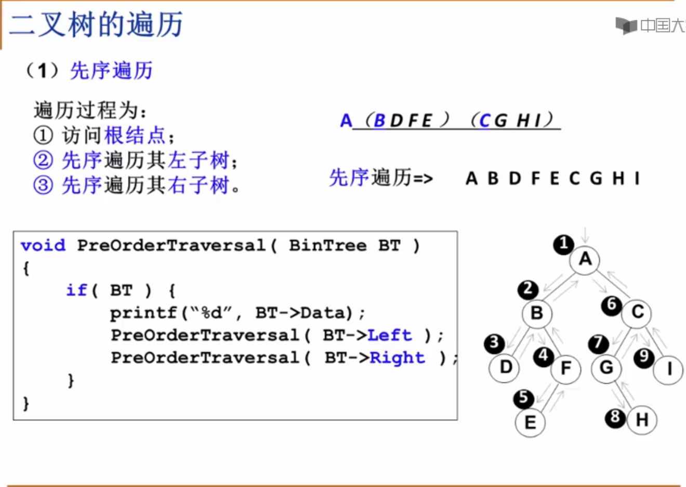
    - 中序遍历
    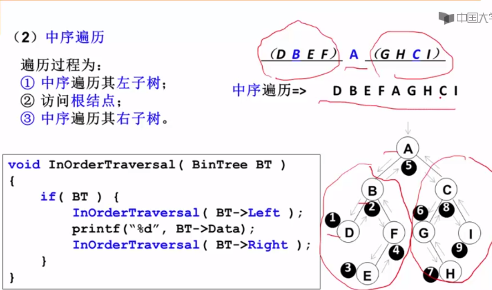
    - 后序遍历
    
    - 中序遍历非递归遍历算法
    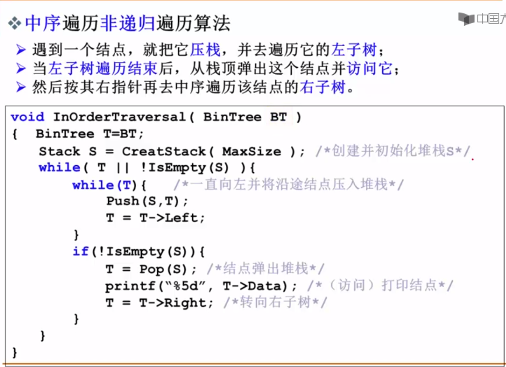
    - 层序基本过程
    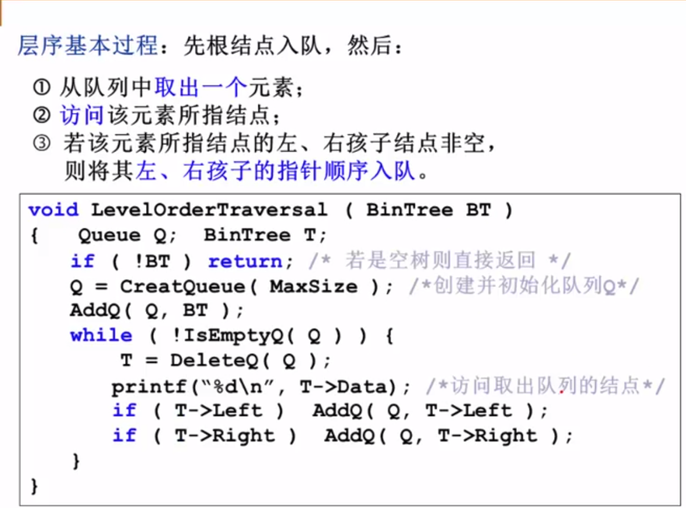

2. 二叉搜索树
- 二叉搜索树的定义
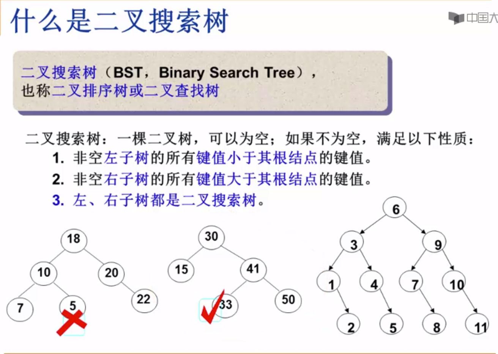

3. 平衡二叉树
- 平衡二叉树的定义1
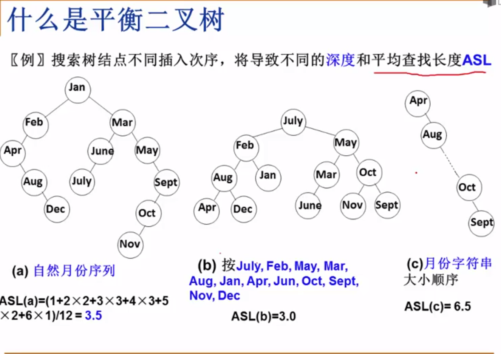
- 平衡二叉树的定义2
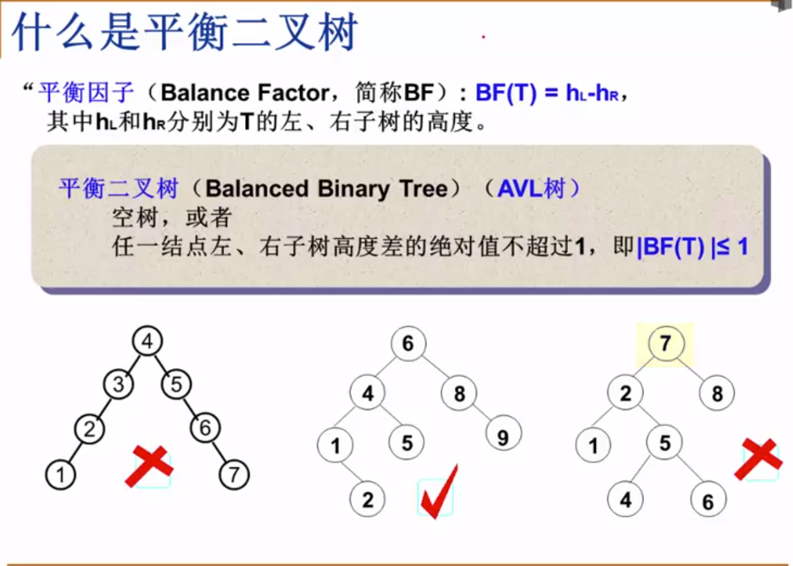

## 图(Graph)
### 图定义
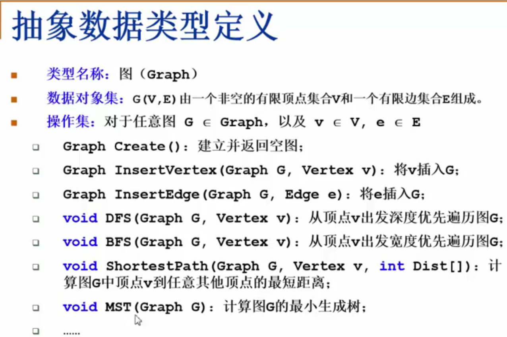
- 在程序中表示图
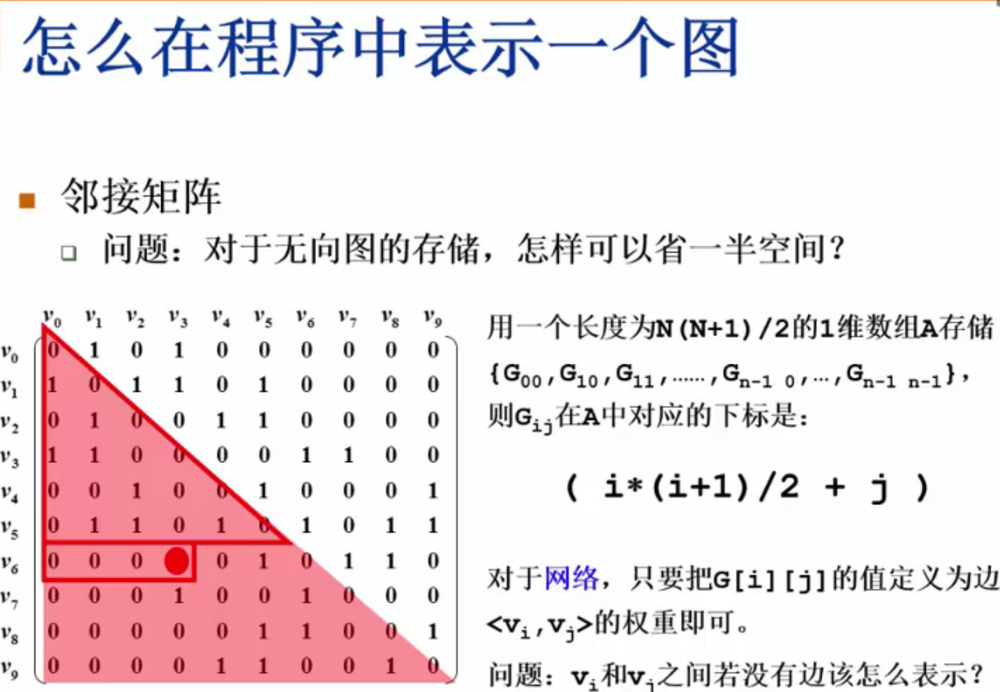
- **_邻接矩阵_** - 好处
  - 直观,简单,好理解
  - 方便检查任意一对顶点间是否存在边
  - 方便找任一顶点的所有“邻接点”（有边直接相邻的顶点）
  - 方便计算任一顶点的“度”（从该点出发的边数为“出度”,指向该点的边数为“入度”）
    - 无向图：对应行（或列）非0元素的个数
    - 有向图：对应行非0元素的个数是“出度”；对应列非0元素的个数是“入度”
- 邻接矩阵 - 有什么不好
  - 浪费空间 - 存稀疏图（点很多而边很少）有大量无效元素
    - 对稠密图（特别是完全图）还是很合算的
  - 浪费时间 - 统计稀疏图中一共多少条边
- **_邻接表_**：G[N]为指针数组,对应矩阵每行一个链表,只存非0元素
    - 对于网络,结构中要增加权重的域
    - 一定要稀疏才合算
  - 方便找任一顶点的所有“邻接点”
    - 节约稀疏图的空间
    - 需要N个头指针 + 2E个结点（每个结点至少两个域）
    - 方便计算任一顶点的“度”？
        - 对无向图： yes
        - 对有向图： 只能计算“出度”；需要构造“逆邻接表”（存指向自己的边）来方便计算“入度”
    - 方便检查任意一对顶点间是否存在边？
        - No

### 图的遍历
- 深度优先搜索(Depth First Search, DFS)
- 广度优先搜索(Breadth First Search, BFS)


